

# 系统概述

## 系统定位

面向计算机学院党员发展全流程管理，支持微信小程序端与PC端协同操作，覆盖入党申请人、积极分子、发展对象、预备党员、正式党员全阶段，实现组织管理、流程管控、材料归档、考核评价一体化，替代线下纸质流程，提升党建工作效率与规范性。

## 核心功能说明

**用户管理**

1.  用户管理：支持系统用户的新增、修改、删除、查询及角色、机构分配；

2.  机构管理：支持机构的新增、修改、删除、启用与停用及基础信息设置；

3.  角色管理：支持角色的新增、修改、删除及PC端、小程序端权限分配。

**党员评价**

1.  PC端数据管理：支持评价时段管理、党员评价数据导入编辑及报告生成；

2.  PC端评价结果管理：支持各类评价报告查看、导出，学院党委可撤回报告；

3.  小程序端个人信息完善：支持学生首次登录完善个人信息，可延后处理；

4.  小程序端考核评价报告：支持多角色查看报告，可筛选年份、调整排名；

5.  小程序端评价报告明细：各角色可查看对应层级的评价详情及排名。

**党员发展管理**

1.  申请人阶段：支持入党申请提交、审核及申请进度查看；

2.  入党积极分子阶段：支持积极分子确定、培育考察及材料审核流转；

3.  发展对象阶段：支持发展对象确定、培训、审核及全流程备案操作；

4.  预备党员接收阶段：支持预备党员编组及入党宣誓相关操作；

5.  预备党员转正阶段：支持转正考察、申请审核及全流程转正操作。

## 系统登录
### PC端

- 访问方式

使用浏览器，输入网址（http://party-eval-ai.ismartcube.cn/#/login） 进入中大AI党建评估系统登录页，建议谷歌浏览器。

- 登录流程

输入网址后，在登录页面输入账号、密码→点击"登录"按钮→系统将对输入的账号和密码进行登录验证。

### 小程序端

- 访问方式

  现阶段仅支持微信扫描二维码方式进入小程序。

  

- 登录流程

使用微信扫一扫功能，扫描上图二维码进入小程序登录页→输入账号、密码→点击"登录"按钮→系统将对输入的账号和密码进行登录验证。

**补充事项**

1.  若账号或密码错误，系统将弹出提示框，显示"账号或密码错误"，请仔细核对输入的账号和密码，确认无误后再次尝试登录；

2.  若多次尝试仍无法登录或忘记密码，请联系管理员进行处理。

# 用户管理

## 用户管理

### 新增用户

进入系统后，选择【用户管理】→【用户管理】，点击"+新增用户"进入新增页面→完善用户信息→点击"确定"完成新增操作。

注：1、角色来源于【用户管理-角色管理】模块；

2.  所属组织来源于【党务管理-党群组织管理】模块；

3.  所属机构来源于【用户管理-机构管理】模块，注意先选择组织才可以选择机构；

4.  密码需同时包含大小写字母、数字和特殊字符，长度8位以上。

    

### 修改用户信息-用户管理页面

  进入系统后，选择【用户管理】→【用户管理】→点击"编辑"进入编辑用户页面→修改用户信息→点击"确定"完成修改操作。

 

### 修改用户信息-个人中心页面

- **个人信息修改**

  鼠标指针悬停（hover）至登录账号名称→点击"个人中心"→切换至个人信息tab→点击"编辑"，进入编辑状态→修改个人信息→点击"保存"完成修改操作。

  注：用户角色不支持编辑。

  

- **密码修改**

  鼠标指针悬停（hover）至登录账号名称→点击"修改密码"→切换至密码tab→依次输入原始密码、新密码、确认密码→点击"保存"完成修改操作。

  注：修改密码成功后，3秒后自动跳转至登录页面。

  

- **头像修改**

  鼠标指针悬停（hover）至登录账号名称→点击"个人中心"或"修改密码"，进入个人中心页面→点击"更换头像"→点击"选择照片"上传头像→点击"确认修改"完成修改。

  

### 删除用户

  进入系统后，选择【用户管理】→【用户管理】→选择所要删除的用户，点击"删除"→点击"确定"完成删除操作。

  注：删除用户后，该用户将无法登录系统，且无法恢复，请谨慎操作！

## 机构管理

### 新增机构

  进入系统后，选择【用户管理】→【机构管理】→点击"新增"进入新增机构页面→填写机构信息→点击"确定"完成新增机构操作。

  注：1、机构类型包括：班级、研究所、党支部、团支部、学院党委、学院团委；

2.  上级机构固定展示计算机学院；

3.  培养类型包括：研究生、本科生；

4.  状态默认开启。

### 编辑机构

  进入系统后，选择【用户管理】→【机构管理】→点击"编辑"进入编辑机构页面→修改机构信息→点击"确定"完成编辑机构操作。

### 开启、停用机构

  进入系统后，选择【用户管理】→【机构管理】→选择机构→点击滑块更改状态，或者进入编辑页面更改状态。

  注：1、机构停用条件：

1.  该机构无关联用户；

2.  该机构无关联组织；

3.  该机构下级机构已全部停用。

    2、计算机学院不支持停用操作。

### 删除机构

  进入系统后，选择【用户管理】→【机构管理】→选择所要删除的机构，点击"删除"→点击"确定"完成删除机构操作。

  注：1、正在启用的机构不支持删除，请先停用机构再进行删除操作；

2.  计算机学院不支持删除操作。

## 角色管理

### 新增角色

  进入系统后，选择【用户管理】→【角色管理】→点击"新增"进入新增角色页面→填写角色信息→点击"确定"完成新增角色操作。

  注：角色标识具有唯一性，不可重复添加。

  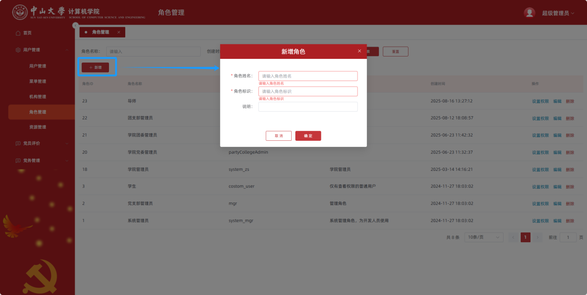

### 编辑角色

  进入系统后，选择【用户管理】→【角色管理】→点击"编辑"进入编辑角色页面→修改角色信息→点击"确定"完成编辑角色操作。

### 删除角色

  进入系统后，选择【用户管理】→【角色管理】→选择所要删除的角色，点击"删除"→点击"确定"完成删除角色操作。

  注：删除角色可能导致数据丢失或所属角色账号无法登录等后果，且无法恢复，请谨慎操作！

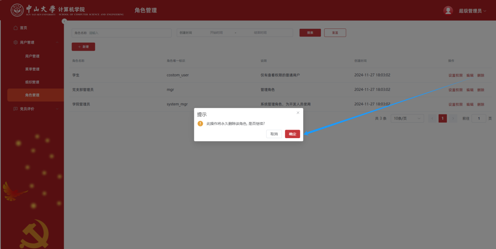

### 设置权限

- **操作步骤**

  进入系统后，选择【用户管理】→【角色管理】→选择角色→点击"设置权限"进入权限设置页面→勾选权限→点击"确定"完成权限设置。

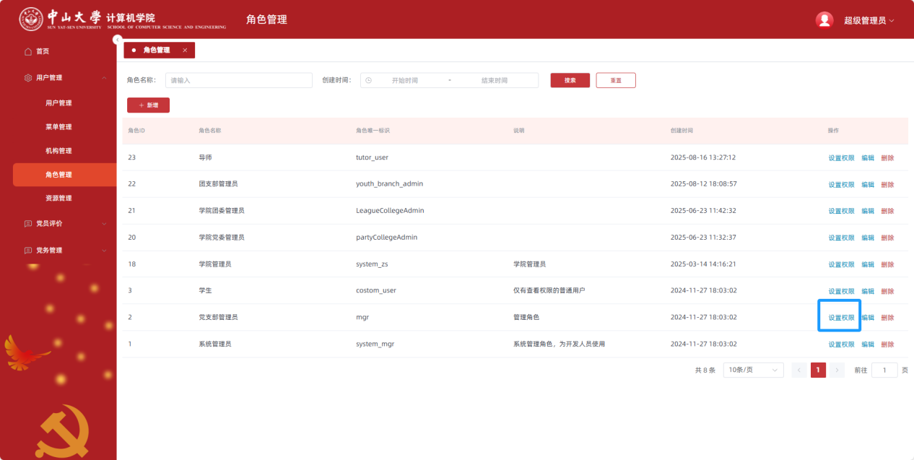

- **权限分配**

  **PC端权限功能**

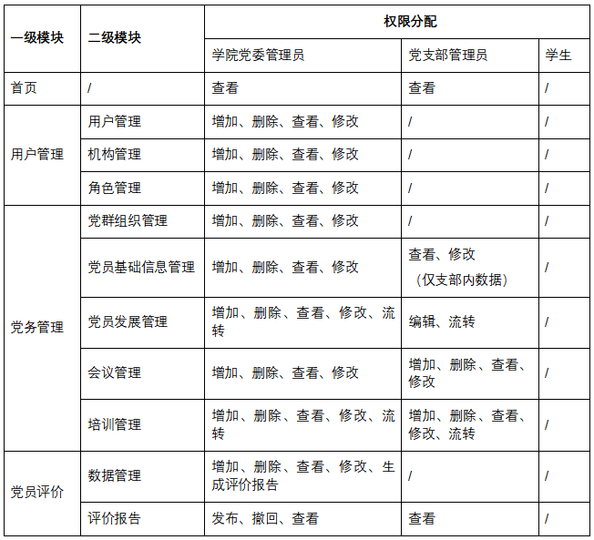{width="5.75625in" height="2.8958333333333335i}

**小程序端权限功能**

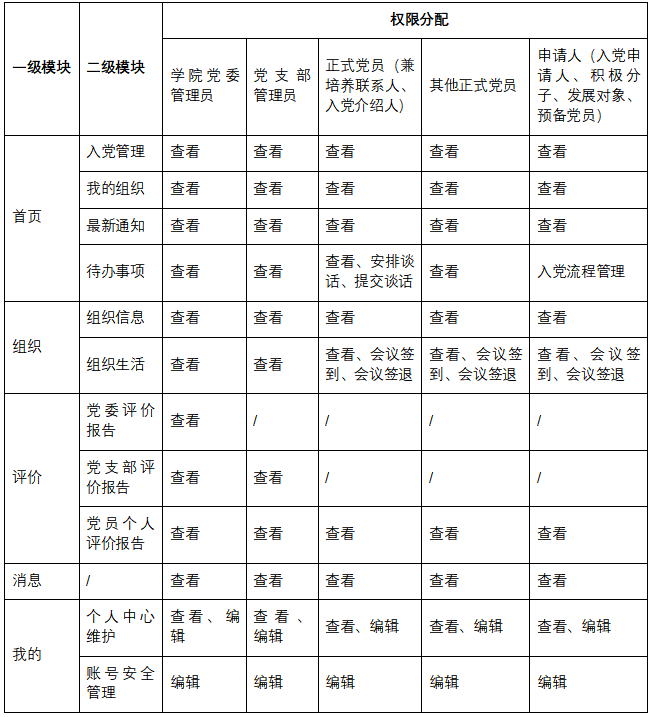{width="5.75625in" height="2.8958333333333335i}

# 党员评价

## PC端

### 数据管理

#### 数据管理首页

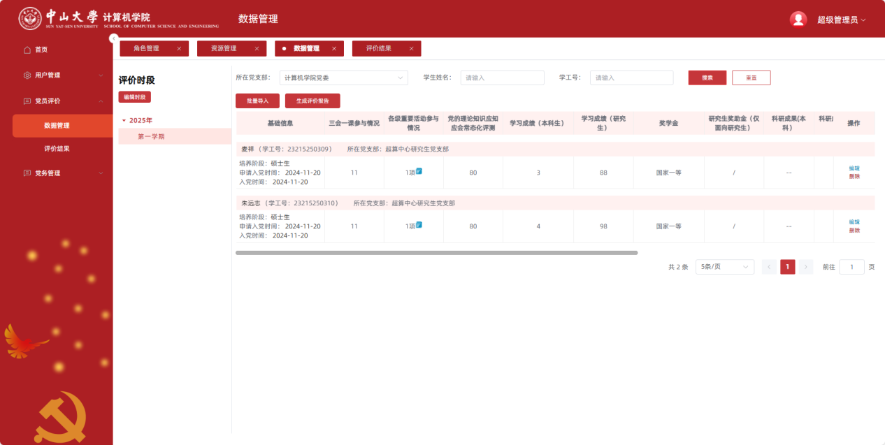

#### 数据管理-评价时段-添加

进入系统后，选择【党员评价】→【数据管理】→点击"编辑时段"进入评价时段编辑页面→添加评价年份→添加评价学期→点击"保存"完成新增评价时段操作。

注：在评价时段编辑状态下，可以拖动评价学期至任一个评价年份中。

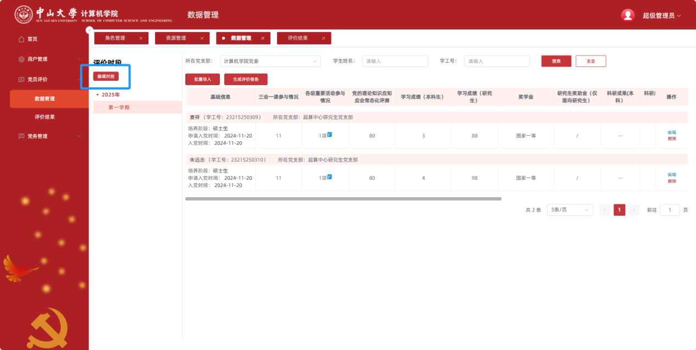

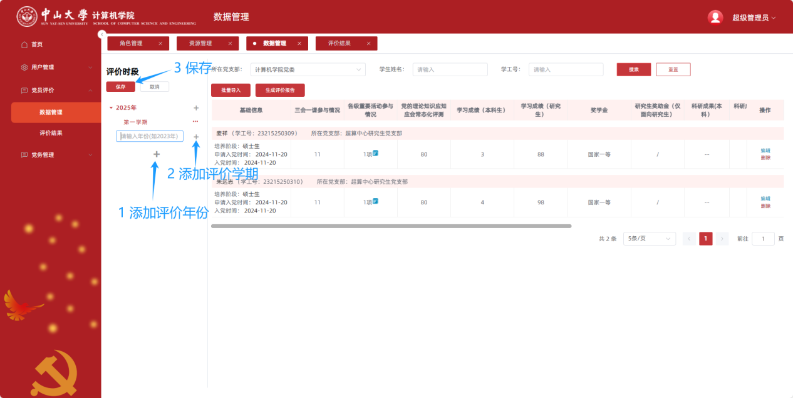

#### 数据管理-评价时段-编辑、删除

进入系统后，选择【党员评价】→【数据管理】→点击"编辑时段"进入评价时段编辑页面→鼠标指针悬停（hover）至评价时段→点击"重命名"或"删除"完成编辑操作。

注：1、若评价学期全部删除，评价年份也随之删除；

2、评价年份不支持重命名操作。

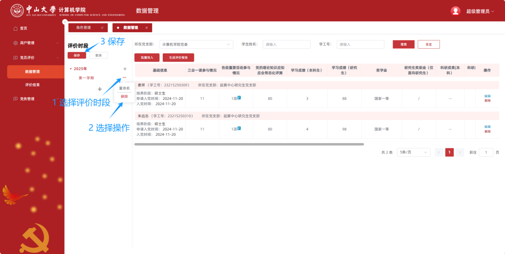

#### 数据导入页面

进入系统后，选择【党员评价】→【数据管理】→点击"批量导入"进入数据导入页面→点击"选择文件"上传文件→点击"确定导入"完成数据导入操作。

注：1、姓名、学号、党支部是必填项，为空则禁止导入；

2、数据文件中的用户必须已添加至用户管理中；

3、若选择局部导入，培养类型为必选项。

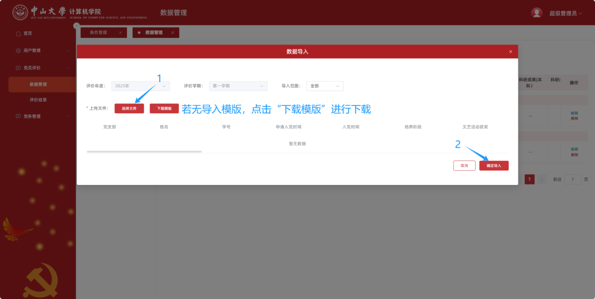

#### 数据编辑页面

进入系统后，选择【党员评价】→【数据管理】→点击"编辑"进入数据编辑页面→修改数据信息→点击"确定"完成数据编辑操作。

注：编辑数据后，记得再次点击"生成评价报告"更新数据。

#### 生成评价报告

进入系统后，选择【党员评价】→【数据管理】→点击"生成评价报告"，跳转至评价结果页面。

注：若该评价时段暂未导入数据，则无法点击生成评价报告。

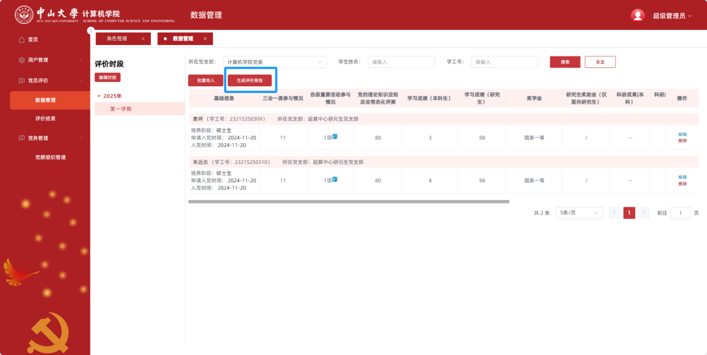

### 评价结果

#### 评价报告-查看

进入系统后，选择【党员评价】→【评价结果】→选择评价时段→通过顶部tab切换不同类型的评价报告，如学院党委评价报告、党支部评价报告和党员个人评价报告。

注：各角色查看评价报告权限如下：

1.  党委账号：学院党委评价报告、党支部评价报告、党员个人评价报告；

2.  党支部管理员账号：党支部评价报告（仅可查看本支部评价报告）；

3.  学生账号：党员个人评价报告（仅可查看个人评价报告）

- 学院党委评价报告

  

- 党支部评价报告

  

- 党员个人评价报告

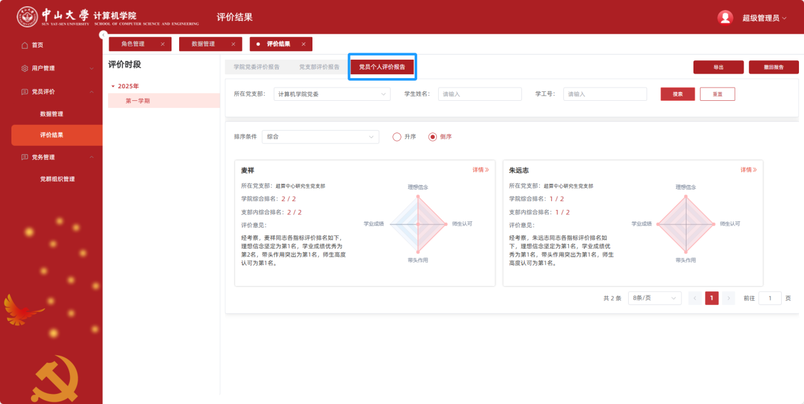

#### 评价报告-导出

进入系统后，选择【党员评价】→【评价结果】→选择评价时段→通过顶部tab切换不同类型的评价报告→点击"导出"即可将评价报告以PDF形式导出。

注：各角色导出评价报告权限如下：

1.  党委账号：学院党委评价报告、党支部评价报告、党员个人评价报告；

2.  党支部管理员账号：党支部评价报告（仅可导出本支部评价报告）；

3.  学生账号：党员个人评价报告（仅可导出个人评价报告）

- 学院党委评价报告

  

#### 评价报告-撤回

进入系统后，选择【党员评价】→【评价结果】→选择评价时段→进入学院党委评价报告页面→点击"撤回报告"即可完成撤回操作。

注：1、撤回报告仅开放给学院党委账号；

2、撤回报告后，党支部以及学生个人将无法查看报告。

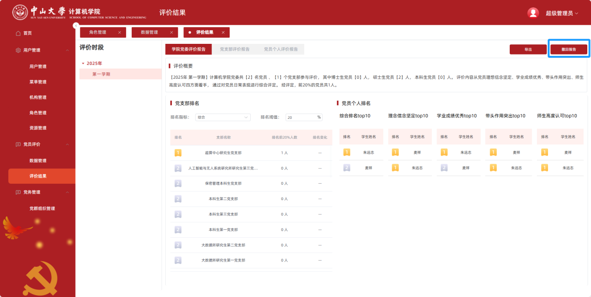

## 小程序端

### 个人信息完善

开放角色：学生。

学生首次登录小程序后，需要先完善个人信息，根据要求补充信息后点击提交即可。也可点击稍后处理先进入小程序，待下次登录后再完善信息。

按钮功能：

**1、前往完善个人信息：**点击前往个人信息完善页面。

**2、稍后处理：**可跳过完善个人信息步骤，先进入小程序，待下次登录后再完善信息。

**3、暂存：**暂时保存个人信息，退出该页面后个人信息将不会保存，需重新填写。

**4、提交：**所有信息按照要求填写完成后方可点击提交进入小程序。

注：个人信息关乎后续的党员发展，请务必尽早完善。

### 考核评价报告首页

开放角色：学院党委、二级支部、学生。

登录小程序后，默认进入评价页面。

考核评价报告数据来源：PC端【党员评价-评价结果】。评级报告由学院党委发布，未发布的报告、已撤回的报告均不展示在小程序中。

功能操作：

1.  **下拉选择框：**进行评价年份筛选，默认展示全部。

2.  **排名方式：**时间排名（最早、最晚）、名次排名（最前、最后），默认排名方式为时间最晚。

3.  **评价时段面板：**点击对应的评价时段即可查看评价报告明细。

    

### 评价报告明细-学院党委

开放角色：学院党委。

**党总支概况：**展示该评价时段下的党总支名称以及学生人数。

**评价概要：**对参与该评价时段的二级支部、党员以及评价指标进行简要说明。

**支部排名情况：**默认展示该评价时段下各支部前20%的党员人数以及对比上一评价时段的排名变化情况。

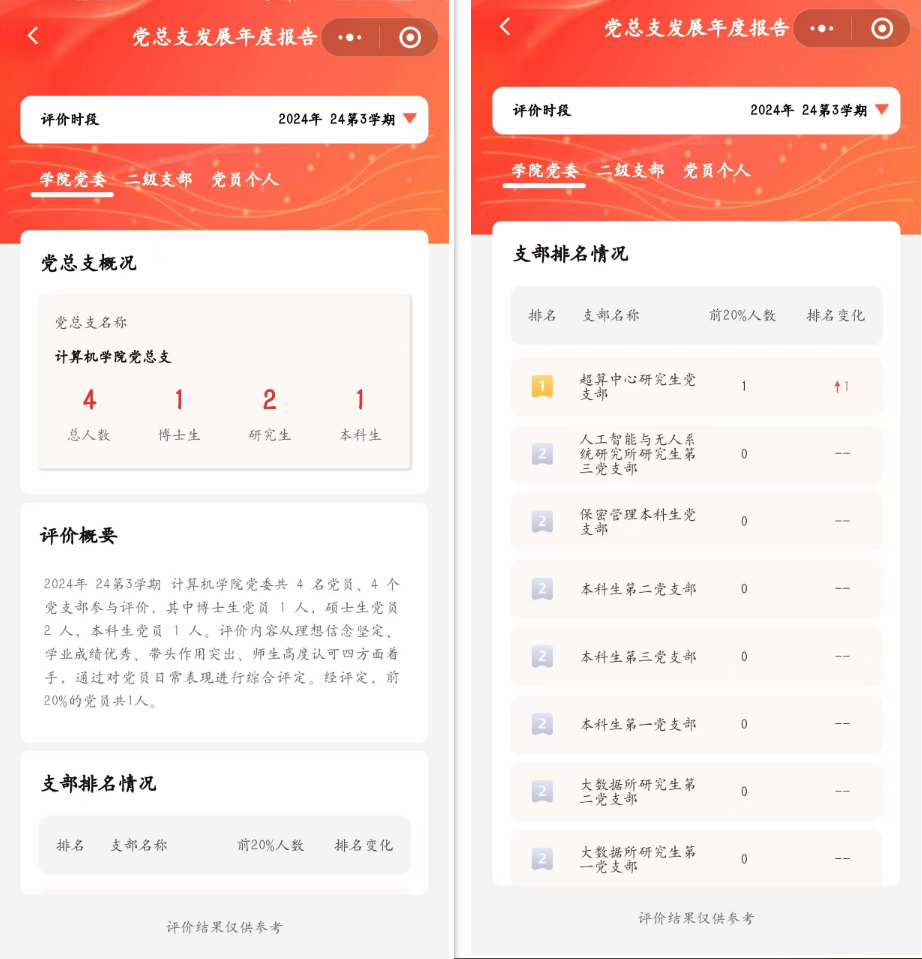

**学院内排名前20%的党员人数：**默认展示该评价时段下学院内前20%的党员情况。可根据需求切换不通指标以及排名阈值。

**党员个人排名top10：**默认展示该评价时段下各指标排名前10的党员姓名以及综合排名下该党员对比上一评价时段的排名变化情况。

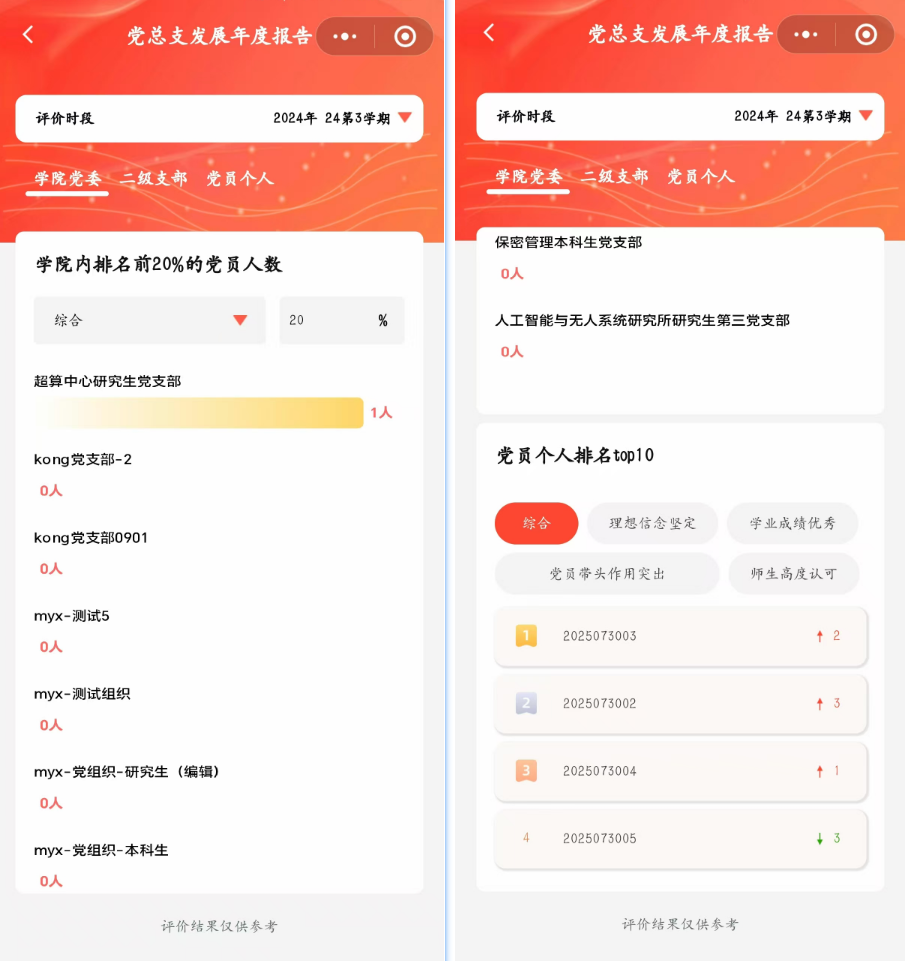

### 评价报告明细-二级支部

开放角色：学院党委、二级支部（仅可查看本支部）。

**党支部概况：**展示该评价时段下的党支部名称以及学生人数。

**评价概要：**主要展示该评价时段下党支部各评价指标在学院中的排名情况。

**支部历史排名变化：**展示所有评价时段里党支部在学院中的综合排名情况。

**学院内前20%的党员人数：**展示所有评价时段里，党支部在学院内前20%的党员人数。可根据需求切换不通指标以及排名阈值。

**支部内党员排名：**展示该评价时段下的党支部内各指标的党员排名情况以及综合排名下该党员对比上一评价时段的排名变化情况。

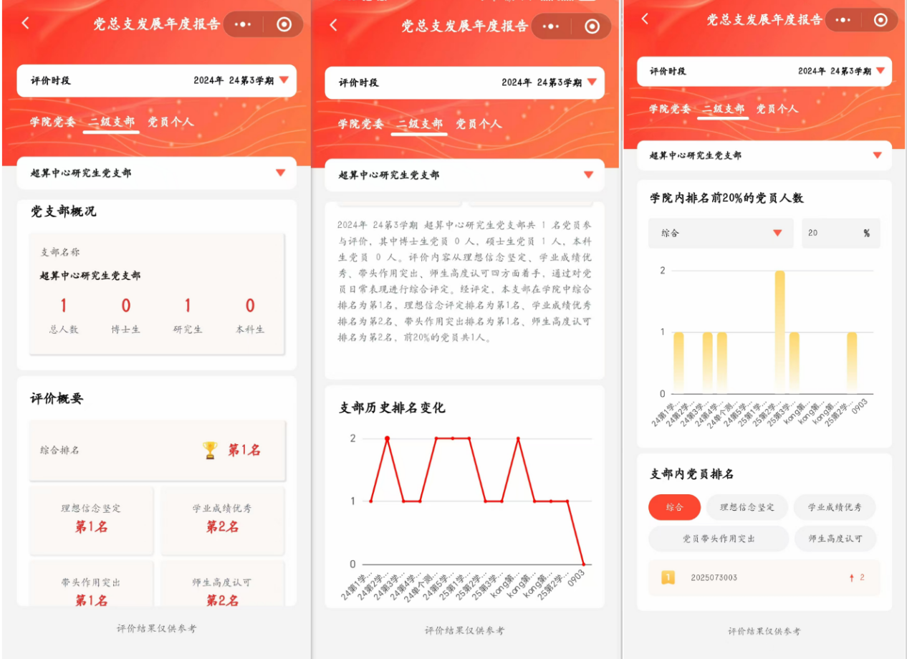

### 评价报告明细-党员个人

开放角色：学院党委、二级支部（仅可查看本支部）、学生（仅可查看本人）。

**党委、二级党支部：**进入评价时段后，切换至【党员个人】页面，点击党员名字即可查看该党员的评价报告。

**学生：**进入小程序后，点击评价时段即可查看本人在该评价时段下的评价报告。

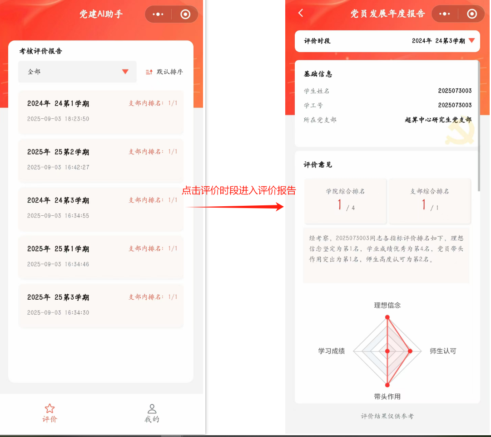

**基础信息：**主要展示学生姓名、学工号以及所在党支部。

**评价意见：**主要展示该评价时段下学生各指标的排名以及在学院、支部内的综合排名情况。

**评价指标排名：**主要展示该评价时段下学生各指标在学院中的排名情况。

**排名变化趋势：**主要展示该学生所有评价时段里各指标在学院、支部内的排名情况。

# 党群组织管理

## 党群组织管理

计算机学院党委、计算机学院团委、群众这三类一级组织已自动添加至系统中。

### 新增党组织、团组织

进入系统后，选择【党务管理】→【党群组织管理】→点击"新增"→选择党组织或团组织→进入对应的新增页面→填写组织信息→点击"确定"完成新增组织操作。

注：1、组织名称具有唯一性，不可重复。

2、组织状态默认开启。

- 新增党组织

  

- 新增团组织

  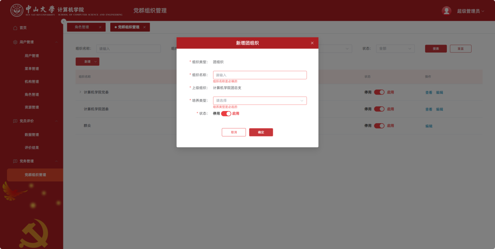

### 查看组织

进入系统后，选择【党务管理】→【党群组织管理】→选择对应的组织→点击"查看"→进入查看页面

- 查看学院党委信息

  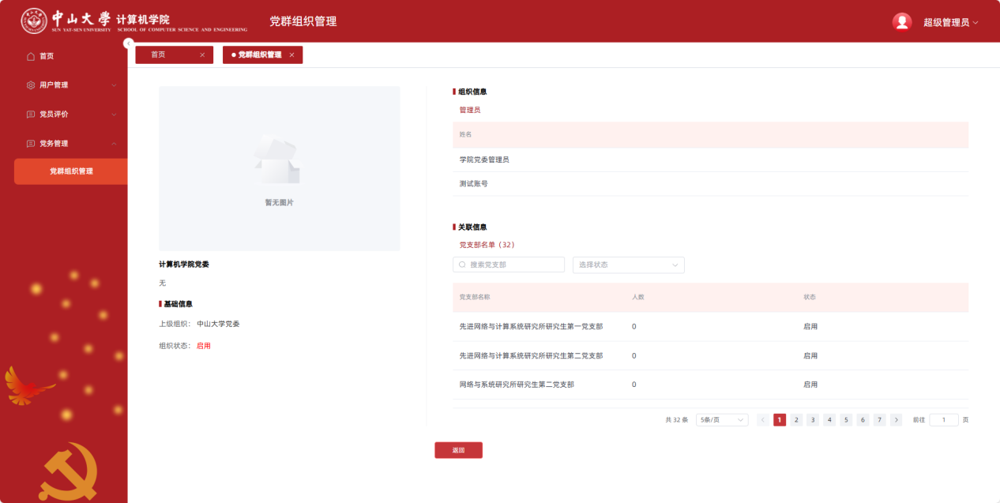

- 查看党支部信息

  

- 查看学院团委信息

  

- 查看团支部信息

  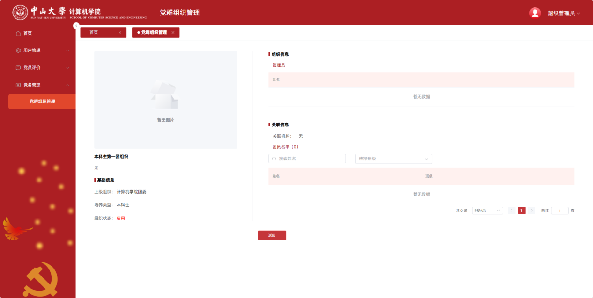

### 编辑组织

进入系统后，选择【党务管理】→【党群组织管理】选择组织→点击"编辑"进入编辑组织页面→修改组织信息→点击"确定"完成编辑组织操作。

注：1、关联信息为必填项，先选择培养类型，再选择关联机构。

2、党群组织与机构的关联关系：

-------------- ----------------------------------------------------------------------------
  **党群组织**   **可选关联机构**

  研究生党支部   研究生党支部(对应的同名机构，一般只有一个)、研究所(展示所有研究所选项)

  研究生团支部   研究生团支部(对应的同名机构,一般只有一个)研究所(展示所有研究所选项)

  本科生党支部   本科生党支部(对应的同名机构，一般只有一个)、所有"培养类型"为本科生的团支部

  本科生团支部   本科生团支部(对应的同名机构，一般只有一个)、所有"培养类型"为本科生的班级
-------------- ----------------------------------------------------------------------------

### 开启、停用组织

进入系统后，选择【党务管理】→【党群组织管理】→选择组织→点击滑块更改状态，或者进入编辑页面更改状态。

注：组织停用条件：该组织无任何关联机构。

### 删除组织

进入系统后，选择【党务管理】→【党群组织管理】→选择所要删除的组织，点击"删除"→点击"确定"完成删除组织操作。

注：1、正在启用的组织不支持删除，请先停用组织再进行删除操作；

2.  计算机学院党委、计算机学院团委、群众均不支持删除操作。

    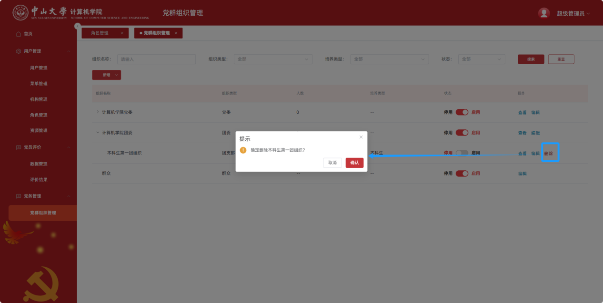

# 党员基础信息管理

展示所有已关联该党支部的用户，管理员可对其进行查看与编辑，党学生无法在小程序端完善个人基础信息时，可由党支部管理员进行编辑。

1.  进入【党务管理-党员基础信息管理】页面，选择所有查看基础信息的学生，点击"查看"按钮，即可查看该学生的基础信息；

2.  进入【党务管理-党员基础信息管理】页面，选择所有查看修改基础信息的学生，点击"编辑"按钮，即可进入编辑页面，编辑完成后点击"提交"按钮即可完成编辑操作。

# 党员发展管理

## 申请入党阶段

### 登录并完善个人基本信息

1.  使用微信扫一扫功能，扫描"计聚先锋"小程序二维码进行登录（由学院党委分配账号），输入账号和密码进入微信小程序。

2.  首次登录需完善个人信息，点击"前往完善个人信息"按钮，进入个人·基本信息完善界面。

3.  按要求填写个人相关信息，点击"提交"按钮即可开启入党流程。

### 入党申请书递交

#### 申请人（小程序端）

进入首页后，点击"我想入党"入口→查看入党申请条件→按界面提示上传入党申请书图片→填写申请书落款时间→提交。

**补充事项**

1.  需先完成个人基础信息录入，未完成则无法进入申请流程；

2.  未满18周岁无法提交申请；

3.  党支部管理员审核前，支持自行撤回上传操作；

4.  核结果不通过的，可按退回原因修改后重新提交。

 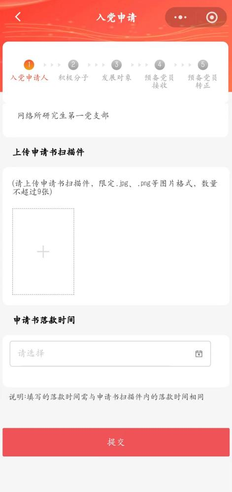 

#### 党支部管理员（PC端）

当申请人无法在小程序端上传入党申请书时，可由党支部管理员代理上传。

1.  进入【新增入党申请】按钮，弹出新增入党申请弹窗；

2.  选择所要代理上传入党申请的学生，点击上传入党申请书，选择落款时间

3.  点击"确定"按钮完成代理操作。

    **补充事项**

<!-- -->

1.  所选择的学生必须先完成基础信息的填写（学生自行填写/党支部管理代理完善），否则搜索不到该学生；

2.  已上传过入党申请的学生，不会出现在选择列表中。

### 入党申请书审核

#### 党支部管理员（PC端）

1.  进入【入党申请人】列表，选择所要审核入党申请书的申请人，点击其操作栏的"审核入党申请"按钮；

2.  弹出审核页，查看申请人信息及入党申请书提交情况；

3.  确定审核结果；点击"审核通过"，完成审核并进入下一环节；点击"审核不通过"，需填写审核不通过理由并通知申请人重新提交，直至审核通过。

    

    **补充事项**

<!-- -->

1.  也可点击"批量操作-入党申请-审核入党申请"进入批量审核页面，审核操作同上。

    

    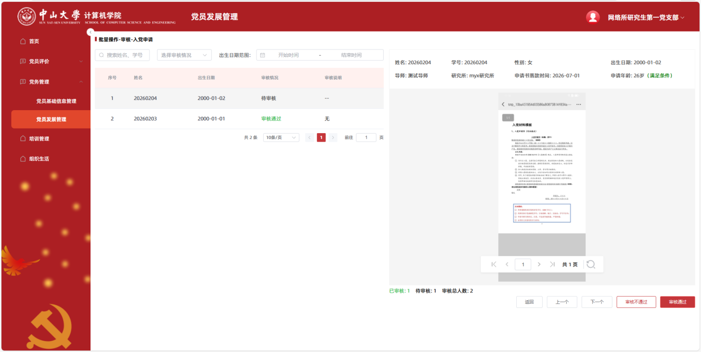

### 党组织派人谈话

#### 党支部管理员（PC端）

##### 指派谈话人

指派正式党员作为谈话人→审核《入党申请人谈话记录表》。

1.  进入【入党申请人】列表，选择所要安排谈话的申请人，点击其操作栏的"指派谈话"按钮；

2.  进入【批量操作-流转-指派谈话】页面，为申请人安排谈话人并设置谈话记录截止提交时间，点击"确定完成指派操作"。

    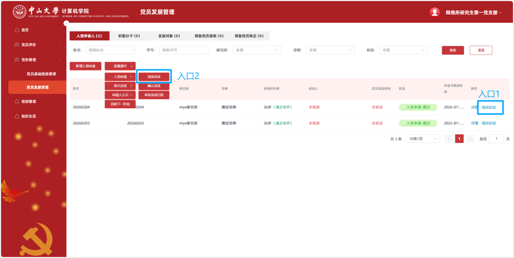

##### 上传谈话记录

党支部管理员可代理填写并上传谈话记录。

1.  进入【入党申请人】列表，选择所要上传谈话记录的申请人，点击其操作栏"上传谈话"按钮；

    

2.  进入【上传谈话】页面，完善谈话信息，点击"确定"按钮；

    

3.  返回【入党申请人】列表首页，再次点击申请人操作栏"确认谈话"按钮，完成上传操作。

##### 审核谈话记录

1.  进入【入党申请人】列表，选择所要审核谈话记录的申请人，点击其操作栏的"审核入党申请"按钮；

2.  弹出审核页，检查谈话记录填写情况；

3.  确定审核结果，点击"审核通过"，完成审核并进入下一环节；点击"审核不通过"，需填写审核不通过理由并通知申请人重新提交，直至审核通过。

    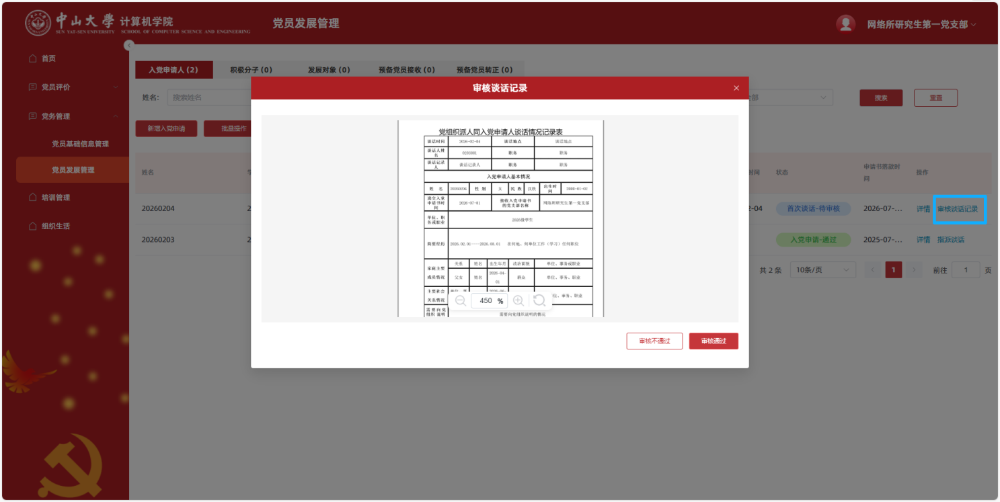

    **补充事项**

<!-- -->

1.  也可点击"批量操作-首次谈话-审核谈话记录"进入批量审核页面，审核操作同上。

    

#### 谈话人（小程序端）

接收安排谈话提醒→安排谈话地点、时间，按时参加谈话→谈话后填写《入党申请人谈话记录表》并提交。

##### 安排谈话日程

1.  接收谈话安排提醒后，点击待办事项的"安排"按钮，进入【谈话日程】页面；

2.  填写完毕点击"确认安排谈话日程"完成安排谈话操作，谈话日程同步至申请人端。

     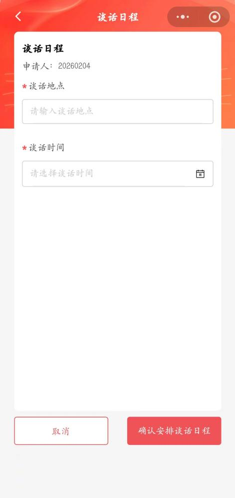

##### 提交谈话记录

1.  安排谈话日程后，点击待办事项"详情"按钮，进入谈话记录页面；

2.  确认申请人基本情况，可点击查看谈话提纲，填写谈话记录并点击提交；

3.  党支部审核通过则进入下一环节，反之需重新提交直至审核通过。

     

### 申请人公示

#### 党支部管理员（PC端）

审核谈话记录完成后，确定公示名单→启动公示流程→公示期结束后生成公示文件→完成公示：无异议则推进下一阶段，并推送公示结果给申请人。

1.  进入【入党申请人】列表，选择确认公示的申请人，点击其操作栏的"公示管理"按钮；

    

##### 创建公示

进入【公示管理】页面，点击"新增公示"按钮，新增一条申请人公示，点击"详情"按钮进入公示。

**补充事项**

1.  建议创建公示前，先点击"公示设置"按钮，填写公示基础信息。后续再创建公示时，可自动识别并填入公示基础信息，无需再次填写。

    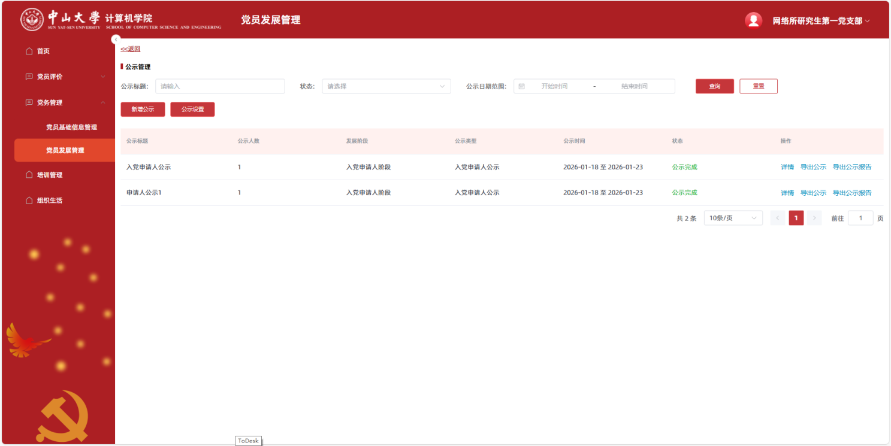

    

##### 设置公示内容

1.  完成并确认公示基础信息是否正确；

2.  选择公示落款日期；

3.  勾选公示名单并填写简要表现情况；

4.  点击"确认并生成公示"按钮生成公示文件。

##### 待公示/公示中/公示期结束

生成公示文件后，根据公示时间判断公示状态：

- 待公示：未到达公示开始时间；

- 公示中：到达公示开始时间，未到公示结束时间（附公示期结束倒计时）；

- 公示期结束：到达公示结束时间。

  **补充事项**

1.  点击"导出公示文件"按钮即可导出页面中的文件至本地。

    

##### 生成公示报告

到达公示期结束后，点击"生成公示报告"按钮生成公示报告，进入【生成公示报告】页。

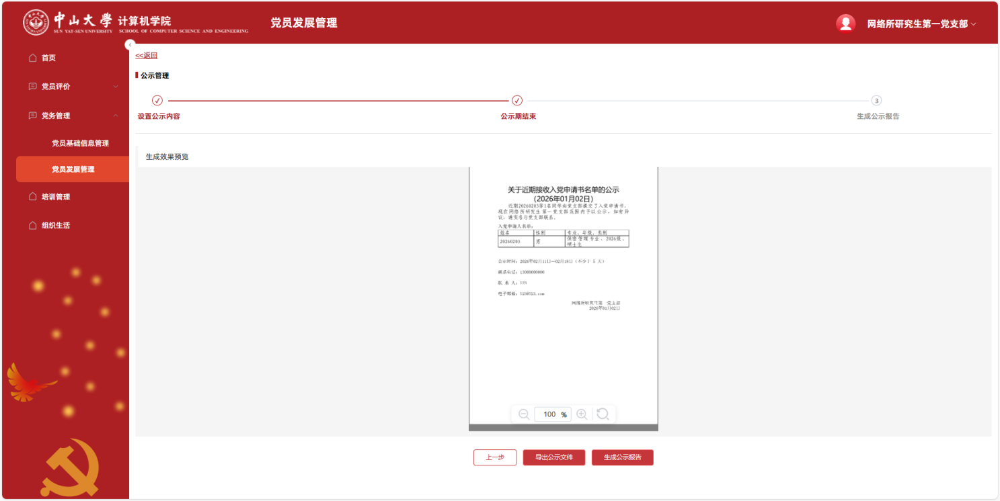

进入【生成公示报告】页后，点击"完成公示"按钮即可完成公示流程。

**补充事项**

1.  点击"导出公示报告"按钮即可导出页面中的文件至本地。

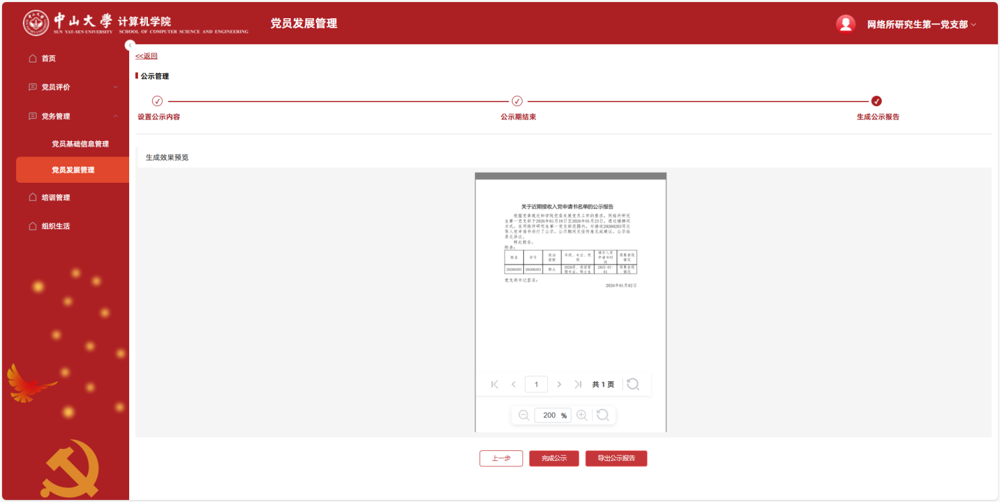

## 入党积极分子的确定和培养教育阶段

### 确定符合条件的申请人

#### 党支部管理员（PC端）

1.  进入【积极分子】列表，选择所要审核发展条件的申请人，点击其操作栏的"审核通过"/"审核不通过"按钮完成发展条件审核；

2.  点击"审核不通过"后，申请人状态变为：发展条件-不通过。可点击"重新发展"按钮回退至积极分子阶段初始状态重新发展；

3.  完成发展条件审核后，点击"流转推优流程"进入推优环节。

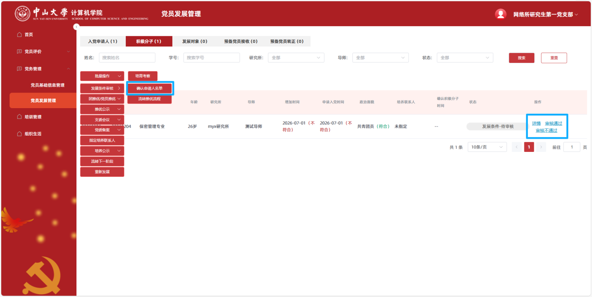

### 团支部推优/党员推优

#### 申请人（小程序端）

##### 提交推优登记表

发展条件审核通过后，核对个人信息并生成推优登记表→打印表格，线下完成表格内容填写→扫描并上传填写完成后的推优登记表。

1.  点击待办事项-推优卡片点击"详情"按钮进入推优页面；

2.  点击"生成推优登记表"，下载推优登记表，线下完成登记表填写；

3.  点击上传扫描件，上传登记表扫描件，点击"上传扫描件"提交到党支部。

**补充事项**

1.  党支部管理员审核前，支持自行撤回上传操作；

2.  审核结果不通过的，可按退回原因修改后重新提交。

  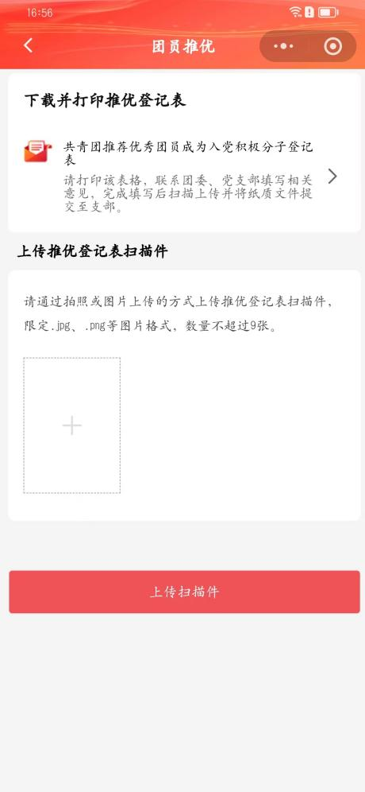

#### 党支部管理员（PC端）

##### 处理推优结果

接收审核通过的材料名单→流转推优流程→申请人提交推优登记表→审核推优登记表→完成推优流程。

1.  进入【积极分子】列表，选择所要审核推优登记表的申请人，点击其操作栏的"处理推优结果"按钮；

    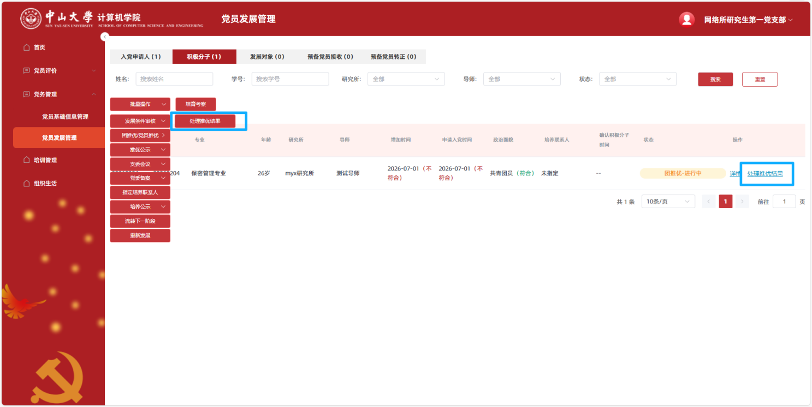

2.  进入【批量操作-流转-处理推优结果】页，查看推优登记表并选择推优时间；

3.  确定推优结果；选择"通过"，完成推优流程并进入下一环节；点击"不通过"，申请人状态变为：团/党员推荐-不通过。可点击"重新发展"按钮回退至从积极分子初始状态重新发展。

### 入党积极分子名单公示

#### 党支部管理员（PC端）

完成推优流程后，确定公示名单→启动公示流程→公示期结束后生成公示报告→完成公示：无异议则进入下一环节，并推送公示结果给申请人。

1.  进入【积极分子】列表，选择进入名单公示的申请人，点击其操作栏的"进入公示"按钮；

    

2.  进入【公示管理】页面，点击"新增公示"按钮，新增一条入党积极分子名单公示。

    公示流程同【第六章 党员发展管理-第一节 入党申请阶段-[[申请人公示]{.underline}](#申请人公示)】，公示流程参考如下图：

    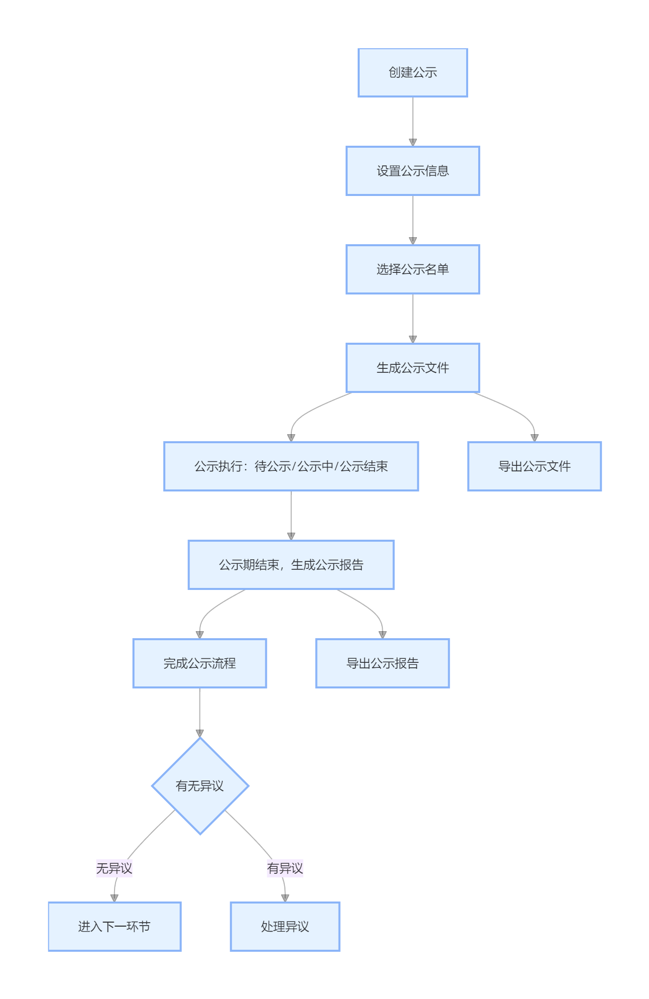

### 填报支委会议时间

#### 党支部管理员（PC端）

完成名单公示后，线下召开支委会→线上填写支委会议时间。

1.  进入【积极分子】列表，选择所要填写支委会议时间的申请人，点击"填报支委会议时间"按钮填写支委会议时间；

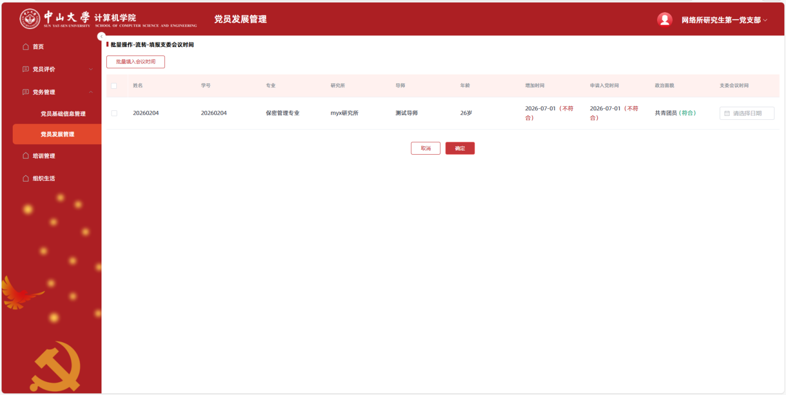

### 上级党委备案

#### 党支部管理员（PC端）

##### 确定并生成备案表

将积极分子备案名单及相关材料提交至学院党委→查看备案进度及结果。

1.  进入【积极分子】列表，选择所要进入上级党委备案的积极分子，点击其操作栏的"流转党委备案"按钮进入【备案管理】页（或者点击批量操作按钮）；

    

2.  点击"新增备案"按钮，新增一条备案；

3.  选择备案填表时间，勾选列表中的名单，点击"确认并生成备案表"；

    

4.  查看备案是否存在的问题，无问题则点击"提交备案"至学院党委，待党委确认并返回备案结果。

#### 学院党委（PC端）

##### 确认备案结果

接收党支部提交的积极分子名单及相关材料→审核备案（备案通过/不通过）→备案结果推送至党支部。

1.  进入【积极分子】列表，选择所要审核备案结果的申请人，点击其操作栏的"查看备案进度"按钮进入【备案管理】页（或者点击批量操作按钮）；

    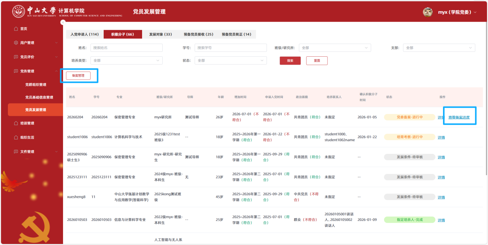

2.  选择备案记录，点击"详情"按钮进入备案结果页；

3.  填写备案时间并确定备案结果；选择"通过"，完成备案流程并进入下一环节；选择"不通过"，申请人状态变为：党委备案-不通过。可点击"重新发展"按钮回退至从积极分子阶段初始状态重新发展。

    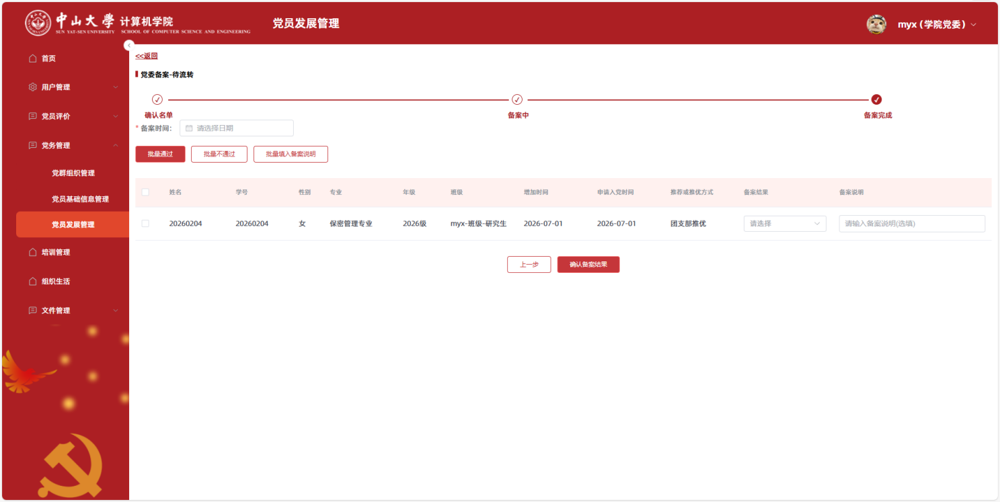

### 指定培养联系人及公示

#### 党支部管理员（PC端）

为每位积极分子指定培养联系人→通知培养联系人及积极分子→确定公示名单→启动公示流程→公示期结束后生成公示报告→完成公示：无异议则推进下一阶段，并推送公示结果给积极分子。

1.  进入【积极分子】列表，选择积极分子，点击其操作栏的"指定培养联系人"按钮（或点击批量操作按钮）；

2.  为积极分子选择培养联系人；

    

3.  指定培养联系人后，选择积极分子，点击其操作栏的"进入公示"按钮（或点击批量操作按钮）；

    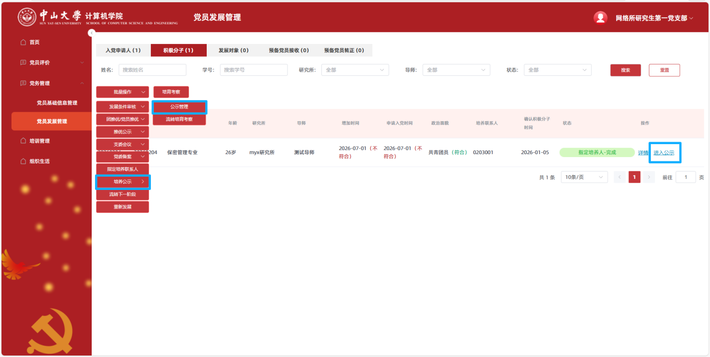

4.  进入【公示管理】页面，点击"新增公示"按钮，新增一条入党积极分子及培养联系人名单公示。

公示流程同【第六章 党员发展管理-第一节 入党申请阶段-[[申请人公示]{.underline}](#申请人公示)】，公示流程参考如下图：

### 培育考察

#### 入党积极分子（小程序端）

##### 上传思想汇报

思想汇报：每季度上传1篇，一年共4篇；审核不通过可修改后重新提交。

1.  点击待办事项-培育考察的"详情"按钮，进入培育考察页面；

2.  点击思想汇报卡片的"查看记录"，点击"立即提交"按钮即可进入提交思想汇报页面；

3.  点击查看思想汇报规范，点击上传思想汇报图片，点击"提交"按钮完成思想汇报上传。

**补充事项**

1.  党支部管理员审核前，支持自行撤回上传操作；

2.  审核结果不通过的，可按退回原因修改后重新提交。

    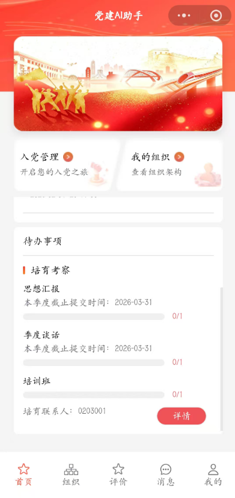  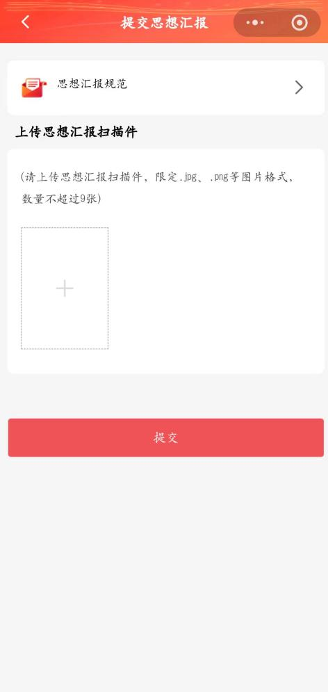

##### 查看季度谈话

每季度与培养联系人线下谈话，提醒谈话人上传谈话记录表，确认本季度谈话完成。

1.  点击待办事项-培育考察的"详情"按钮，进入培育考察页面；

2.  点击思想汇报季度谈话卡片的"查看记录"，查看季度谈话提交情况。

      

##### 参与积极分子培训班

1.  点击待办事项-培育考察的"详情"按钮，进入培育考察页面；

2.  点击培训班参与卡片的"查看记录"，点击"立即报名"按钮即可进入积极分子培训班报名页面；

3.  选择培训班，点击"报名"按钮即可报名；

4.  等待入选结果，入选后按时线下参加培训，培训结束后等待结业通知。

**补充事项**

1.  在党委未流转支部筛选前，可自行取消报名；

2.  大一/研一第一学期学生无法报名培训班；

3.  一次只能报名一个培训班；

4.  未入选或未结业的培训班，可继续报名参与下一次培训班。

      

#### 培养联系人（小程序端）

每季度与积极分子线下谈话，上传谈话记录表，确认本季度谈话完成。

##### 安排谈话日程并上传谈话记录

1.  点击待办事项的培育考察-季度谈话"安排"按钮，安排谈话地点和谈话时间；

2.  安排谈话日程后，点击待办事项的培育考察-季度谈话"详情"按钮，确认谈话人信息后填写并上传谈话记录至的支部；

3.  等待支部返回审核结果。

**补充事项**

1.  在谈话记录页面可点击"谈话内容参考框架.docx"查看参考文件；

2.  党支部管理员审核前，支持自行撤回上传操作；

3.  审核结果不通过的，可按退回原因修改后重新提交。

  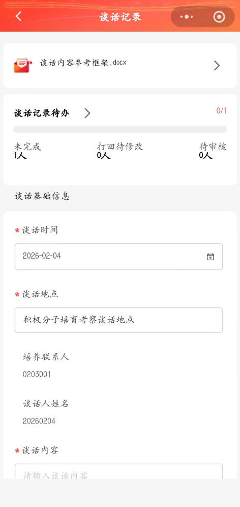

#### 党支部管理员（PC端）

监督积极分子各项任务完成情况→审核思想汇报、接收谈话记录→查看培训班报名及支部排序情况，确定入选名单并提交党委→同步查看培训结业情况→对未按时完成任务的积极分子发出教育提醒→对完成所有考察内容的积极分子，确认考核通过。

进入【积极分子】列表，选择所要审核培育考察任务的积极分子，点击其操作栏的"查看考察进度"按钮进入【培育考察】页（或者点击培育考察按钮）。

##### 审核思想汇报

进入【培育考察】页，点击"审核思想汇报"按钮进入批量审核页面，或点击积极分子操作列的"详情"按钮进入个人审核页面。

**批量审核：**

1.  点击"审核思想汇报"进入批量审核页面，点击左侧积极分子列表，右侧同步展示该积极分子基本信息以及思想汇报；

2.  确定思想汇报审核结果。点击"审核通过"，完成思想汇报审核并进入下一环节；选择"审核不通过"，需填写审核不通过说明；

3.  审核结果同步至积极分子。若审核不通过，积极分子可重新提交思想汇报直至审核通过；

**补充事项**

1.  思想汇报催交。点击"催交"按钮，可发送催交消息至未提交思想汇报或思想汇报审核不通过的积极分子。

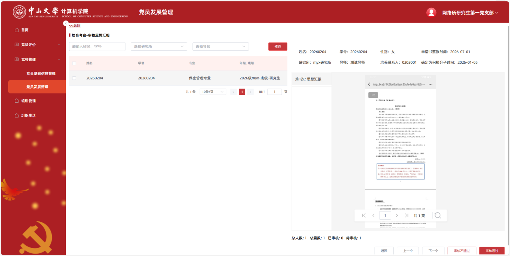

**单个审核：**

1.  点击积极分子操作列的"详情"按钮进入【培育考察-详情】页面；

2.  点击思想汇报卡片的"详情"按钮，展示该积极分子提交的思想汇报；

3.  确定思想汇报审核结果。点击"审核通过"，完成思想汇报审核并进入下一环节；选择"审核不通过"，需填写审核不通过说明；

4.  审核结果同步至积极分子。若审核不通过，积极分子可重新提交思想汇报直至审核通过。

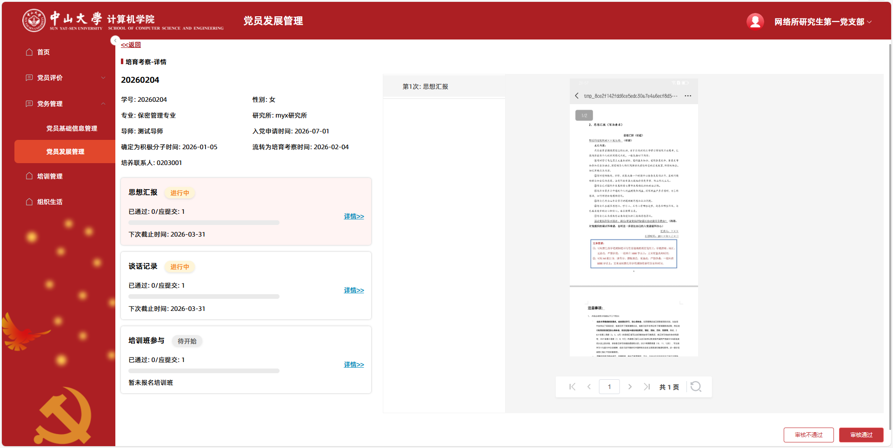

##### 审核谈话记录

进入【培育考察】页，点击"审核谈话记录"按钮进入批量审核页面，或点击积极分子操作列的"详情"按钮进入个人审核页面。

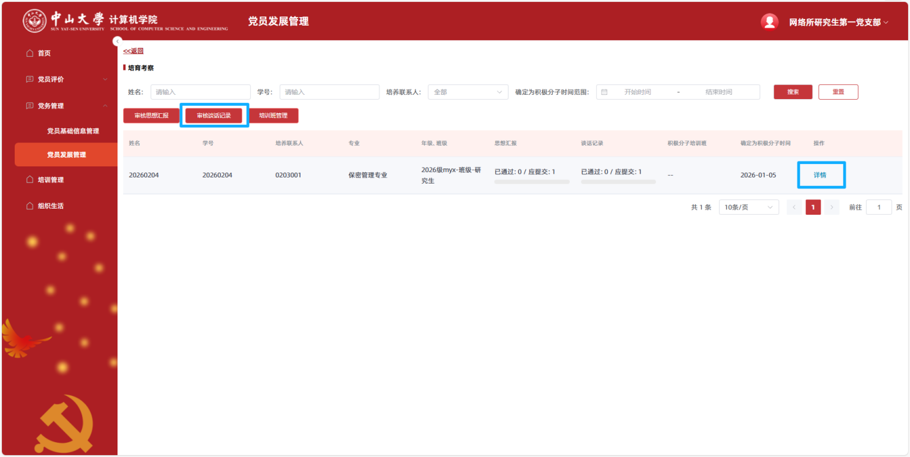

**批量审核：**

1.  点击"审核谈话记录"进入批量审核页面，点击左侧积极分子列表，右侧同步展示该积极分子基本信息以及谈话记录；

2.  确定谈话记录审核结果。点击"审核通过"，完成谈话记录审核并进入下一环节；选择"审核不通过"，需填写审核不通过说明；

3.  审核结果同步至培养联系人。若审核不通过，培养联系人可重新提交谈话记录直至审核通过；

**补充事项**

1.  谈话记录催交。点击"催交"按钮，可发送催交消息至未提交谈话记录或谈话记录审核不通过的积极分子。

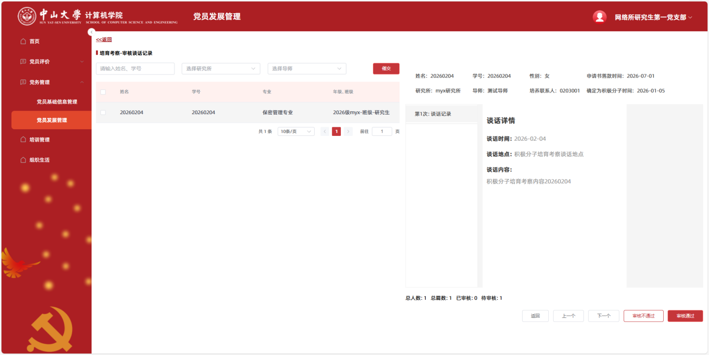

**单个审核：**

1.  点击积极分子操作列的"详情"按钮进入【培育考察-详情】页面；

2.  点击谈话记录卡片的"详情"按钮，展示该积极分子提交的谈话记录；

3.  确定谈话记录审核结果。点击"审核通过"，完成谈话记录审核并进入下一环节；选择"审核不通过"，需填写审核不通过说明；

4.  审核结果同步至培养联系人。若审核不通过，培养联系人可重新提交谈话记录直至审核通过。

    

##### 确认积极分子培训班入选名单

1.  学院党委点击"流转支部筛选"按钮后，党支部可进入【培训管理】页面，选择培训班状态为："支部筛选中"，点击"筛选报名名单"进入【培训管理-详情】页面；

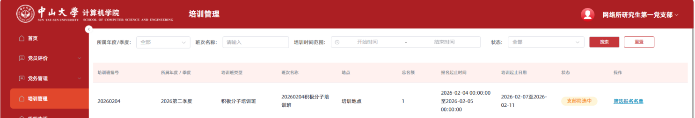

2.  确认入选名单，点击"提交党委"按钮可将入选名单推送至学院党委。

**补充事项**

1.  点击报名积极分子的上移、下移操作可调整入选顺序；

2.  支部报名人数小于等于支部名额，默认所有报名积极分子全部入选。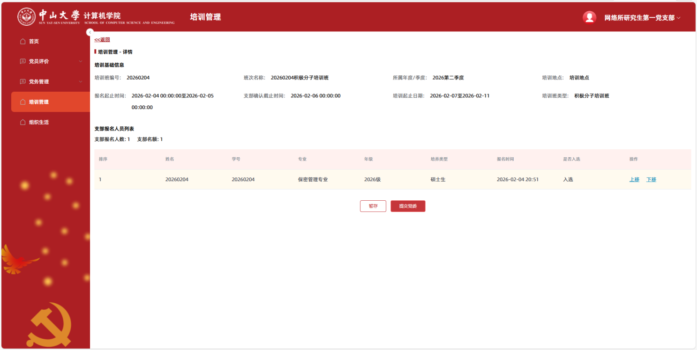

##### 考察通过

所有培训任务完成且通过后，点击"考察通过"完成积极分子阶段的培育考察，流转下一阶段。

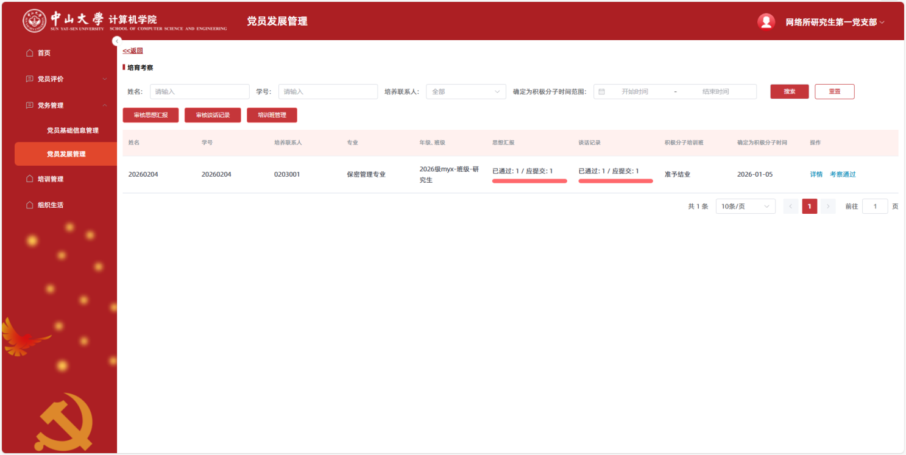

#### 学院党委管理员（PC端）

创建积极分子培训班，设置报名时间、支部名额及发布范围→确认支部上报的入选名单并推送通知→培训结束后，确定结业情况（结业/未结业）。

##### 创建并发布积极分子培训班

1.  进入【培训管理】页，点击"创建培训班"按钮，进入【培训管理-详情】页；

    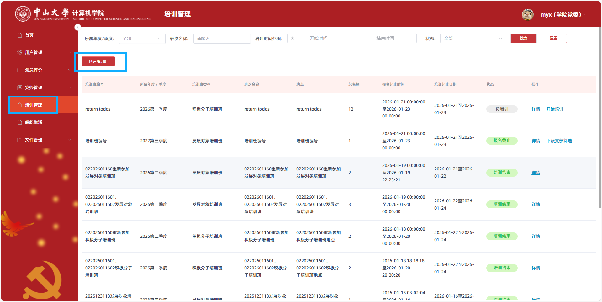

2.  填写培训班基础信息，注意培训班类型选择"积极分子培训班"，分配支部名额后滑到最底下点击"保存并发布"按钮完成培训班创建。

**补充事项**

1.  未到报名时间，培训班状态为：待开始；

2.  到达报名时间，培训班状态变为：报名中。

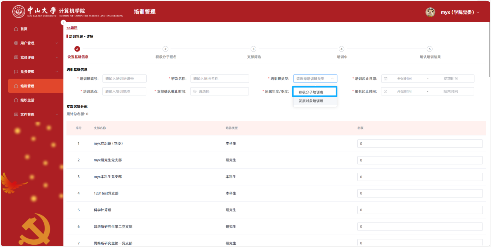

##### 流转支部筛选

到达报名截止时间，点击"流转支部筛选"按钮，等待支部返回入选名单。

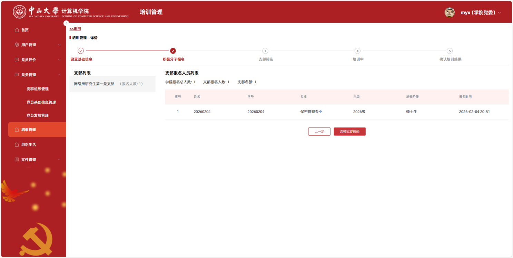

##### 确认入选名单

1.  支部提交入选名单至学院党委后，点击"确认入选名单"确认入选名单。

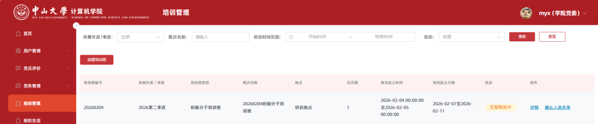

2.  进入【培训管理-详情】页后，待所有支部提交入选名单后，点击"确认入选名单"完成最终名单确认，培训班进入"待培训"状态，入选结果同步至积极分子。

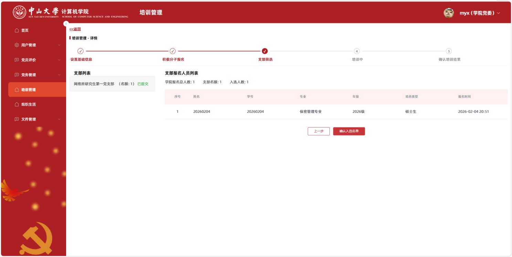

##### 开始培训

点击"开始培训"按钮，培训班状态变为：培训中。培训班状态同步至积极分子。

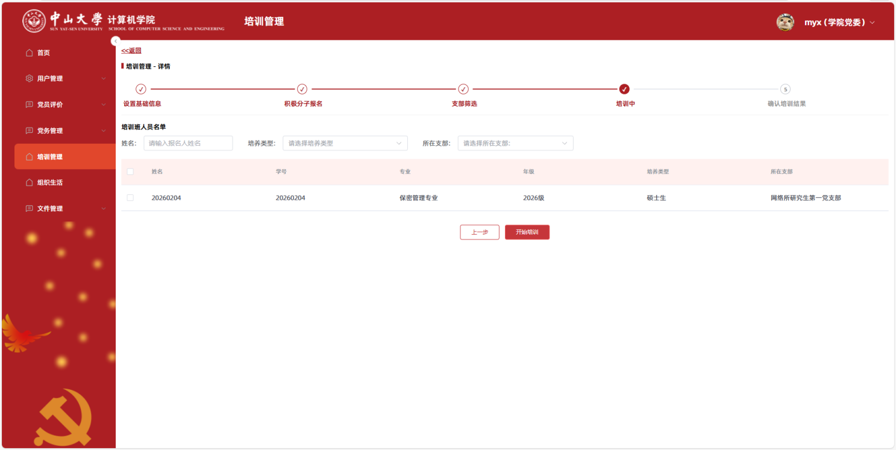

##### 结束培训

到达培训截止时间后，培训班结束，也可手动点击"结束培训"按钮提前结束培训班。

##### 确认培训结果

培训班结束后，填写结业时间和结业情况，点击"确认培训结果"完成培训班，培训结果同步至积极分子。结业情况选择：未结业，则无结业时间，积极分子需再次参加培训班直至准予结业。

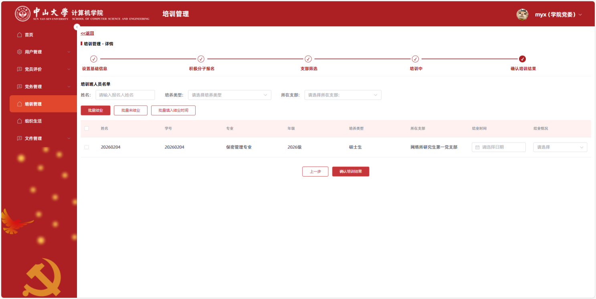

## 入党重点发展对象的确定和培养教育阶段

### 确定符合条件的积极分子

#### 党支部管理员（PC端）

1.  进入【发展对象】列表，选择所要审核发展条件的积极分子，点击其操作栏的"审核通过"/"审核不通过"按钮完成发展条件审核；

2.  点击"审核不通过"后，申请人状态变为：发展条件-不通过。可点击"重新发展"按钮回退至发展对象阶段初始状态重新发展；

3.  完成发展条件审核后，点击"流转推优流程"进入推优环节。

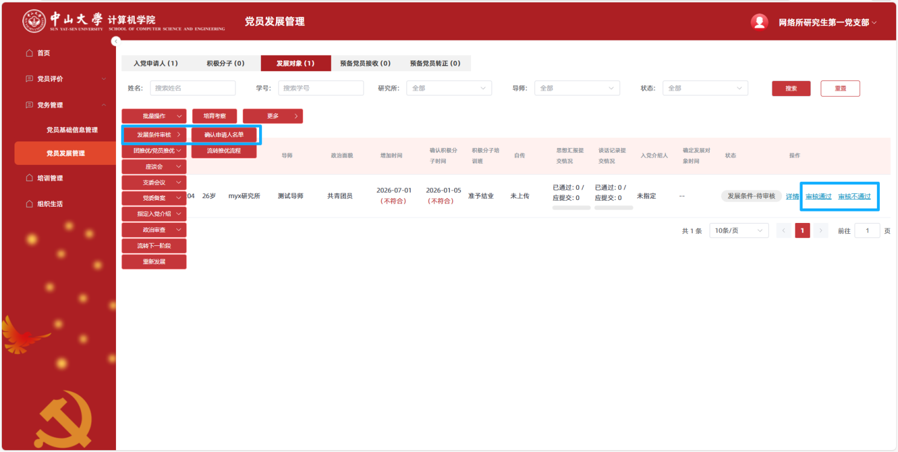

### 团支部推优/党员推优

#### 申请人（小程序端）

##### 提交推优登记表

发展条件审核通过后，核对个人信息并生成推优登记表→打印表格，线下完成表格内容填写→扫描并上传填写完成后的推优登记表。

1.  点击待办事项-推优卡片点击"详情"进入推优页面；

2.  点击"生成推优登记表"，下载推优登记表，线下完成登记表填写；

3.  点击上传扫描件，上传登记表扫描件，点击"上传扫描件提交到党支部"。

**补充事项**

1.  党支部管理员审核前，支持自行撤回上传操作；

2.  审核结果不通过的，可按退回原因修改后重新提交。

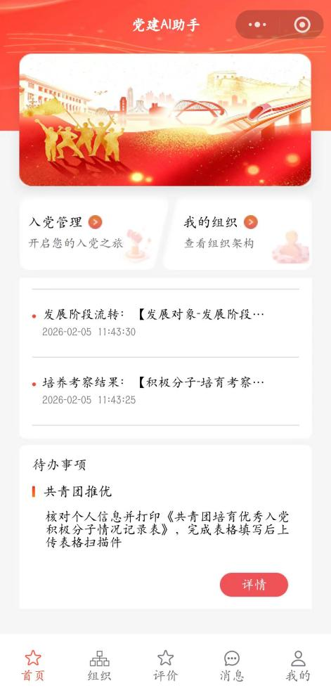 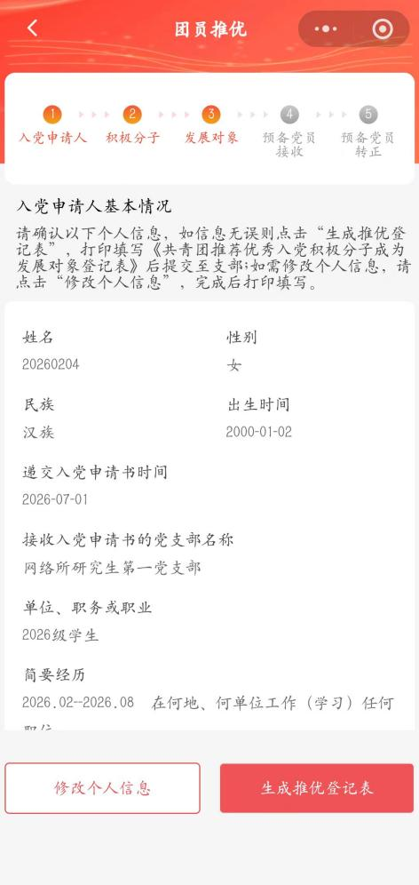 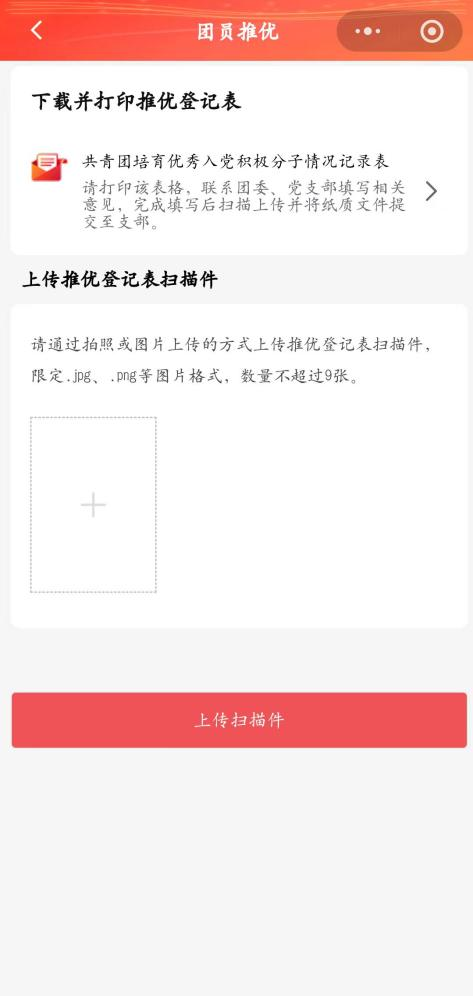

#### 党支部管理员（PC端）

##### 处理推优结果

接收审核通过的材料名单→流转推优流程→申请人提交推优登记表→审核推优登记表→汇总推优成功名单。

1.  进入【发展对象】列表，选择所要审核推优登记表的积极分子，点击其操作栏的"推优管理"按钮（或者点击批量操作按钮）；

    

2.  进入【批量操作-流转-处理推优结果】页，查看推优登记表并选择推优时间；

3.  确定推优结果；选择"通过"，完成推优流程并进入下一环节；点击"不通过"，申请人状态变为：团/党员推荐-不通过。可点击"重新发展"按钮回退至从发展对象初始状态重新发展。

**补充事项**

1.  党支部对积极分子上传的推优登记表有查看、删除和代理上传的操作权限。

### 入党重点发展对象座谈会

#### 党支部管理员（PC端）

组织线下座谈会→线上填写座谈会时间、地点→系统自动生成《入党重点发展对象群众意见原始记录表》（每人1份）→线下完成表格填写→上传《入党重点发展对象群众意见原始记录表》扫描件。

1.  进入【发展对象】列表，选择所要完成座谈会的积极分子，点击其操作栏的"座谈会管理"按钮（或者点击批量操作按钮）；

    

2.  进入【批量操作-流转-座谈会管理】页，填写座谈会时间、地点；

3.  点击"批量导出记录表扫描件"导出《入党重点发展对象群众意见原始记录表》（系统已自动填入基本信息）；

4.  点击"批量上传记录"（或者单个上传），上传填写完成的《入党重点发展对象群众意见原始记录表》

5.  点击"完成座谈会"按钮完成座谈会，进入下一阶段。

**补充事项**

1.  批量导出、上传座谈会记录表时均需勾选列表中的积极分子；

2.  批量上传时，必须严格按照文件名称格式（姓名+学号），否是无法识别文件。

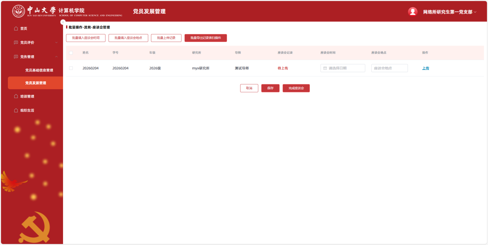

### 支委会议

#### 党支部管理员（PC端）

会前准备，批量导出表决票→组织线下支委会议→会议结束后在系统上填报会议时间、地点、参会情况以及表决结果。

1.  进入【发展对象】列表，选择所要完成支委会议的积极分子，点击其操作栏的"进入支委会议"按钮（或者点击批量操作按钮）；

    

2.  进入【批量操作-流转-填报支委会议时间】页，点击"导出表决票"；

3.  线下完成支委会议后，系统上填报会议时间、地点、参会情况以及表决结果；

4.  点击"确定"按钮完成支委会记录，进入下一阶段。

**补充事项**

1.  表决结果选择"不通过"，申请人状态变为：支委会议-不通过。可点击"重新发展"按钮回退至发展对象初始状态重新发展；

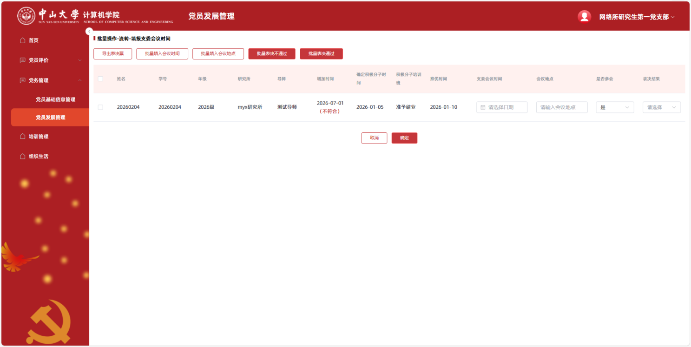

### 上级党委备案

剩余操作同【第二节 入党积极分子的确定和培养教育阶段-[[上级党委备案]{.underline}](#上级党委备案)】一致，这里不再附图说明。

#### 党支部管理员（PC端）

##### 确定并生成备案表

将重点发展对象备案名单及相关材料提交至学院党委→查看备案进度及结果。

1.  进入【发展对象】列表，选择所要进入上级党委备案的积极分子，点击其操作栏的"进入备案"按钮进入【党委备案】页（或者点击批量操作按钮）；

    

2.  点击"新增备案"按钮，新增一条备案；

3.  选择备案填表时间，勾选列表中的名单，确定党支部意见；

4.  点击"确认并生成备案表"；

5.  查看备案是否存在的问题，无问题则点击"提交备案"至学院党委，待党委确认并返回备案结果。

#### 学院党委（PC端）

##### 确认备案结果

接收党支部提交的积极分子名单及相关材料→审核备案→备案通过/不通过→备案结果推送至党支部。

1.  进入【发展对象】列表，选择所要审核备案结果的积极分子，点击"备案管理"按钮进入【党委备案】页；

    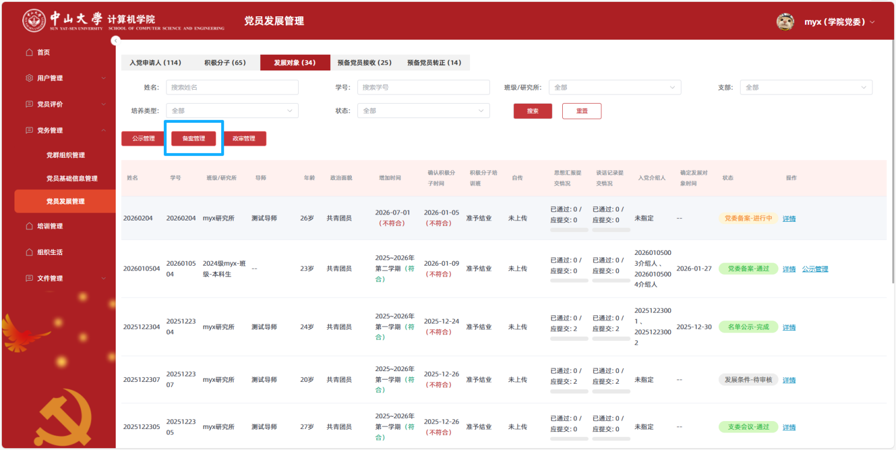

2.  选择处于备案中的备案记录，点击"详情"按钮进入备案结果页；

3.  填写备案时间并确定备案结果；选择"通过"，完成备案流程并进入下一环节；选择"不通过"，申请人状态变为：党委备案-不通过。可点击"重新发展"按钮回退至从发展对象初始状态重新发展。

### 确定入党重点发展对象名单的公示

#### 学院党委（PC端）

完成上级党委备案后，确定公示名单→启动公示流程→公示期结束后确认生成公示报告→完成公示：无异议则推进下一阶段，并推送公示结果给发展对象。

1.  进入【发展对象】列表，点击"公示管理"按钮；

    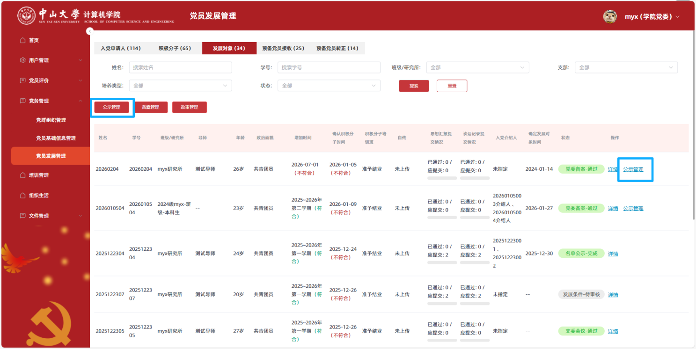

2.  进入【公示管理】页面，点击"新增公示"按钮，新增一条确定入党重点发展对象名单的公示，点击"详情"进入公示；

3.  在设置公示内容页为每个发展对象填入联系人、联系方式、简要情况；

4.  选择公示落款日期，勾选公示名单后按照公示流程完成公示。

    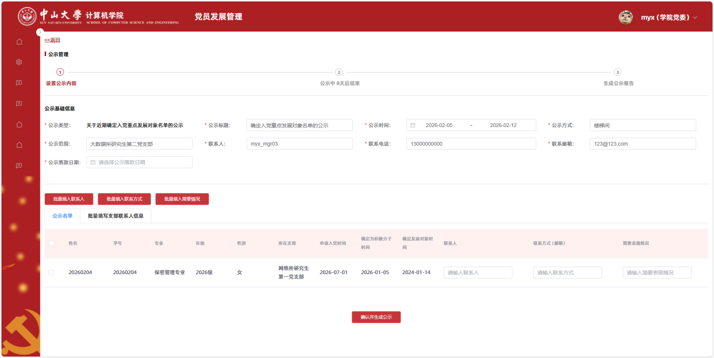

    公示流程同【第六章 党员发展管理-第一节 入党申请阶段-[[申请人公示]{.underline}](#申请人公示)】，公示流程参考如下图：

    

**补充事项：**

1.  设置公示内容时，可切换至批量填写支部联系人信息卡片，在这个新标签页里，只需为每个党支部填写一次对应的联系人和联系方式，系统会自动将每个党支部的联系人信息，同步填充到公示名单中该支部下所有人员的对应字段里，实现一次录入、批量生效。

    

### 确定入党介绍人

#### 党支部管理员（PC端）

为每位发展对象指定2名正式党员作为入党介绍人。

1.  进入【发展对象】列表，选择发展对象，点击其操作栏的"指派入党介绍人"按钮（或点击批量操作按钮）；

2.  为发展对象选择入党介绍人。

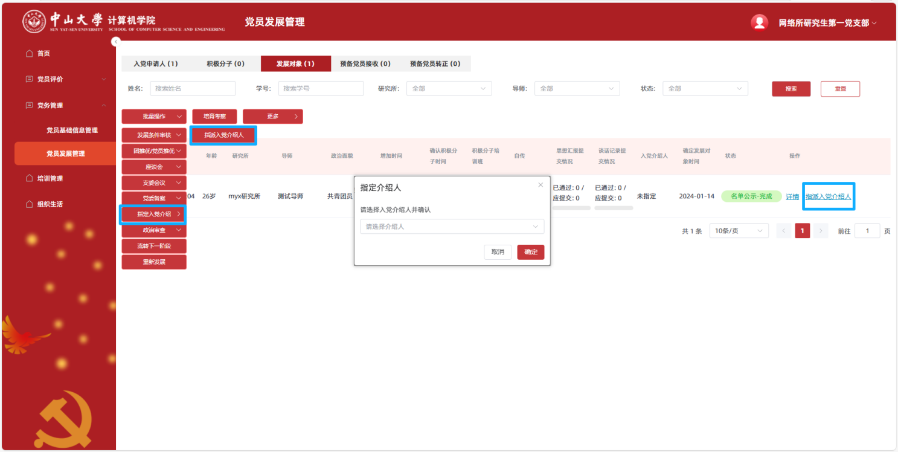

### 入党教育培育考察

入党教育培育考察操作同【第二节 入党积极分子的确定和培养教育阶段-[[培育考察]{.underline}](#培育考察)】一致，参考流程图如下：

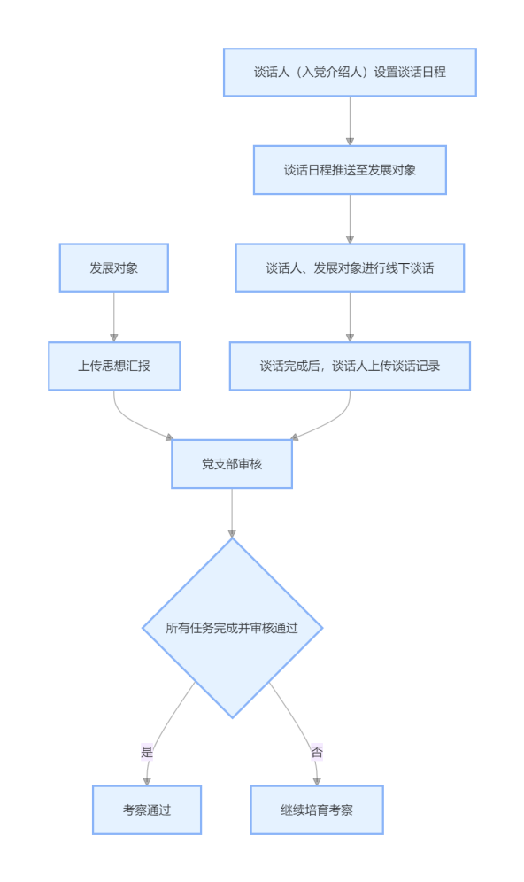

#### 发展对象（小程序端）

##### 上传思想汇报

思想汇报：每季度上传1篇，一年共4篇；审核不通过可修改后重新提交；

1.  点击待办事项-培育考察的"详情"按钮，进入培育考察页面；

2.  点击思想汇报卡片的"查看记录"，点击"立即提交"按钮即可进入提交思想汇报页面；

3.  点击查看思想汇报规范，点击上传思想汇报图片，点击"提交"按钮完成思想汇报上传。

**补充事项**

1.  党支部管理员审核前，支持自行撤回上传操作；

2.  审核结果不通过的，可按退回原因修改后重新提交。

##### 查看季度谈话

每季度与入党介绍人线下谈话，提醒入党介绍人上传谈话记录表，确认本季度谈话完成。

1.  点击待办事项-培育考察的"详情"按钮，进入培育考察页面；

2.  点击思想汇报季度谈话卡片的"查看记录"，查看季度谈话提交情况。

#### 入党介绍人（小程序端）

每季度与发展对象线下谈话，上传谈话记录表，确认本季度谈话完成。

##### 安排谈话日程并上传谈话记录

1.  点击待办事项的培育考察-季度谈话"安排"按钮，安排谈话地点和谈话时间；

2.  安排谈话日程后，点击待办事项的培育考察-季度谈话"详情"按钮，确认谈话人信息后填写并上传谈话记录至的支部；

3.  等待支部返回审核结果。

**补充事项**

1.  在谈话记录页面可点击"谈话内容参考框架.docx"查看参考文件；

2.  党支部管理员审核前，支持自行撤回上传操作；

3.  审核结果不通过的，可按退回原因修改后重新提交。

#### 党支部管理员（PC端）

监督发展对象各项任务完成情况→审核思想汇报、接收谈话记录→对未按时完成任务的发展对象发出教育提醒→对完成所有考察内容的发展对象，流转至下一阶段。

进入【发展对象】列表，选择所要审核培育考察任务的发展对象，点击其操作栏的"查看考察进度"按钮进入【培育考察】页（或者点击培育考察按钮）。

##### 审核思想汇报

进入【培育考察】页，点击"审核思想汇报"按钮进入批量审核页面，或点击发展对象操作列的"详情"按钮进入个人审核页面。

**批量审核：**

1.  点击"审核思想汇报"进入批量审核页面，点击左侧发展对象列表，右侧同步展示该发展对象基本信息以及思想汇报；

2.  确定思想汇报审核结果。点击"审核通过"，完成思想汇报审核并进入下一环节；选择"审核不通过"，需填写审核不通过说明；

3.  审核结果同步至发展对象。若审核不通过，发展对象可重新提交思想汇报直至审核通过；

**补充事项**

1.  思想汇报催交。点击"催交"按钮，可发送催交消息至未提交思想汇报或思想汇报审核不通过的发展对象。

    **单个审核：**

<!-- -->

1.  点击发展对象操作列的"详情"按钮进入【培育考察-详情】页面；

2.  点击思想汇报卡片的"详情"按钮，展示该发展对象提交的思想汇报；

3.  确定思想汇报审核结果。点击"审核通过"，完成思想汇报审核并进入下一环节；选择"审核不通过"，需填写审核不通过说明；

4.  审核结果同步至发展对象。若审核不通过，发展对象可重新提交思想汇报直至审核通过。

##### 审核谈话记录

进入【培育考察】页，点击"审核谈话记录"按钮进入批量审核页面，或点击发展对象操作列的"详情"按钮进入个人审核页面。

**批量审核：**

1.  点击"审核谈话记录"进入批量审核页面，点击左侧发展对象列表，右侧同步展示该发展对象基本信息以及谈话记录；

2.  确定谈话记录审核结果。点击"审核通过"，完成谈话记录审核并进入下一环节；选择"审核不通过"，需填写审核不通过说明；

3.  审核结果同步至入党介绍人。若审核不通过，入党介绍人可重新提交谈话记录直至审核通过；

**补充事项**

1.  谈话记录催交。点击"催交"按钮，可发送催交消息至未提交谈话记录或谈话记录审核不通过的发展对象。

    **单个审核：**

<!-- -->

1.  点击发展对象操作列的"详情"按钮进入【培育考察-详情】页面；

2.  点击谈话记录卡片的"详情"按钮，展示该发展对象提交的谈话记录；

3.  确定谈话记录审核结果。点击"审核通过"，完成谈话记录审核并进入下一环节；选择"审核不通过"，需填写审核不通过说明；

4.  审核结果同步至入党介绍人。若审核不通过，入党介绍人可重新提交谈话记录直至审核通过。

##### 考察通过

所有培训任务完成且通过后，点击"考察通过"完成发展对象阶段的培育考察，流转下一阶段。

### 政审管理

#### 学院党委（PC端）

查看政审信息填写情况→批量生成函调信，设置回信时间及收件信息→跟踪函调进度，确认回收函调信→收集支部政审意见→完成党委审议。

1.  进入【发展对象】列表，点击"政审管理"按钮；

2.  点击"新增政审"按钮，新增一条政审；

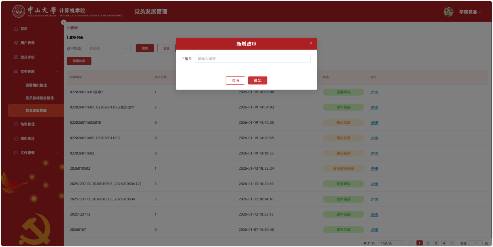

##### 确认名单

新增政审后，点击"详情"进入【确定政审名单】页，勾选进入政审的发展对象，点击"确定政审名单"按钮。

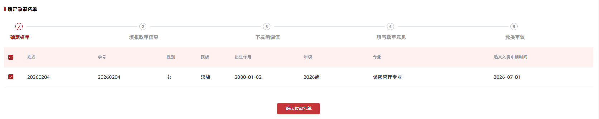

##### 填报政审信息

1.  确认政审名单后，发送填报信息至发展对象，等待发展对象提交政审信息；

2.  发展对象填报政审信息后，点击"详情"查看发展对象提交的政审信息，确认无误后点击"确认信息填报"按钮，进入下一步。

    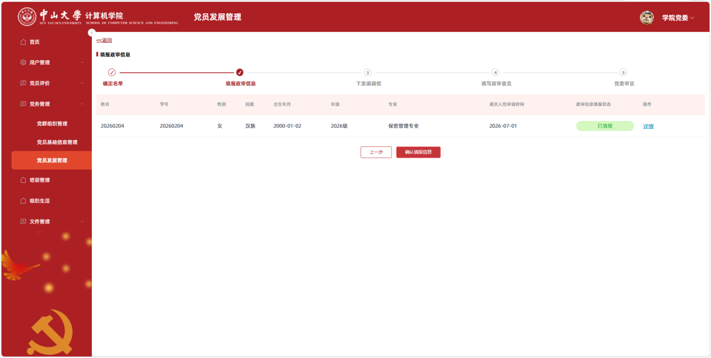

##### 下发函调信

1.  按照要求填写党支部收件人、收件人电话、收件地址和落款时间，点击"生成函调信"按钮生成函调信；

    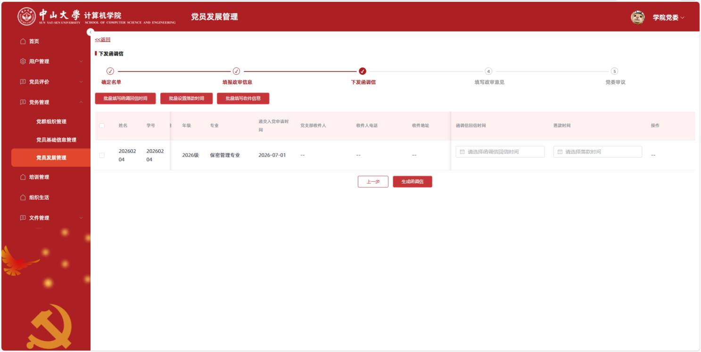

2.  生成函调信后，点击"导出函调信"按钮导出函调信；

    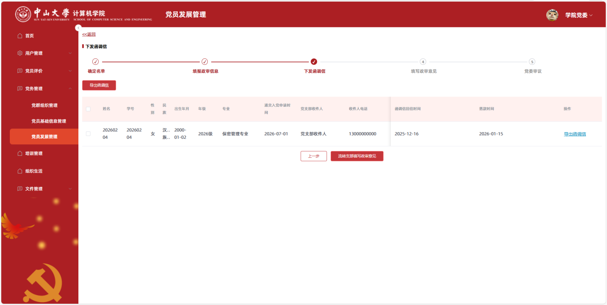

3.  点击"流转支部填写政审意见"按钮，流转至党支部；

4.  等待党支部填写并返回政审意见。

##### 党委审议

党支部提交政审意见后，进入党委审议页面，选择审议结果，上传扫描件后，点击"完成政审"按钮完成政审流程。

审议结果选择"通过"，完成政审流程并进入下一环节；选择"不通过"，发展对象状态变为：政治审查-不通过。可点击"重新发展"按钮回退至从发展对象初始状态重新发展。

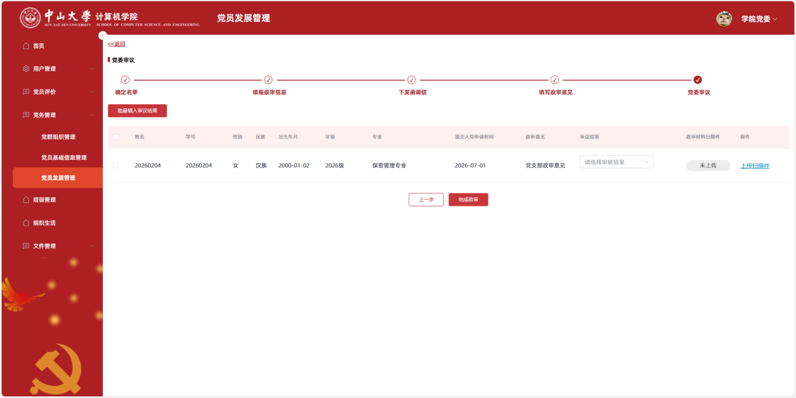

#### 党支部管理员（PC端）

##### 填写政审意见

1.  进入【发展对象】列表，点击"政审管理"按钮；

2.  选择处于"填写政审意见"状态的政审记录，点击"详情"按钮进入填写政审意见页面；

    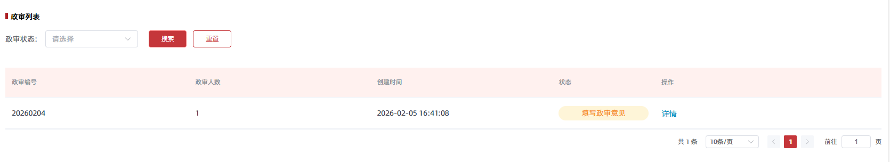

3.  填写政审意见，点击"流转党委审议"按钮提交至学院党委。

    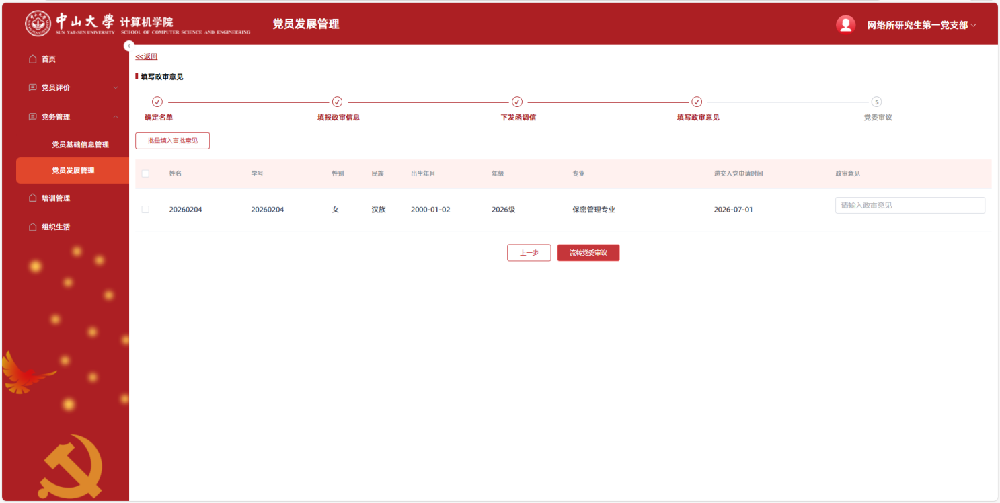

##### 审核自传

1.  进入【发展对象】列表，选择所要审核自传的发展对象，点击其操作栏的"审核自传"按钮（或者点击批量操作按钮）进入【审核自传】页；

    

2.  点击左侧发展对象列表，右侧同步展示该发展对象基本信息以及自传；

3.  确定自传审核结果。点击"审核通过"，完成自传审核并进入下一环节；选择"审核不通过"，需填写审核不通过说明；

4.  审核结果同步至发展对象。若审核不通过，发展对象可重新提交自传直至审核通过。

    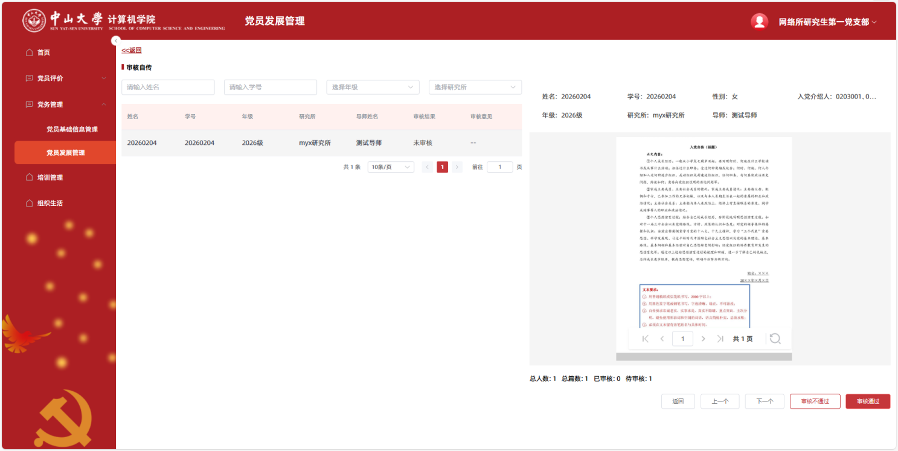

#### 发展对象（小程序端）

##### 填写政审信息

接收提醒，填写并上传直系亲属政审信息→接收政审结果通知。

1.  在待办事项-政治审查卡片点击"详情"按钮，进入【发展对象政审信息收集】页面；

2.  填写两名直系亲属信息，点击"提交"按钮提交至党支部。

    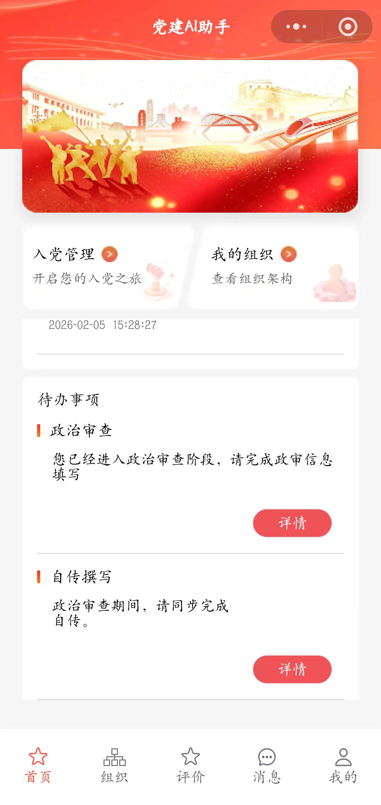 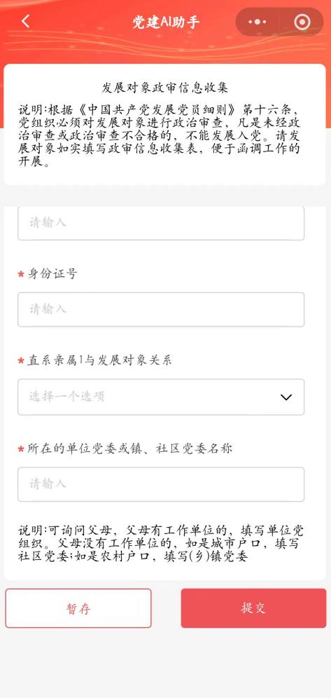

##### 上传自传

接收提醒，撰写自传并上传→接收自传审核通知。

1.  在待办事项-自传撰写卡片点击"详情"按钮，进入【上传自传】页面；

2.  点击查看自传撰写规范；

3.  点击查看自传撰写规范，点击上传自传图片，点击"提交"按钮完成自传上传。

**补充事项**

1.  党支部管理员审核前，支持自行撤回上传操作；

2.  审核结果不通过的，可按退回原因修改后重新提交。

     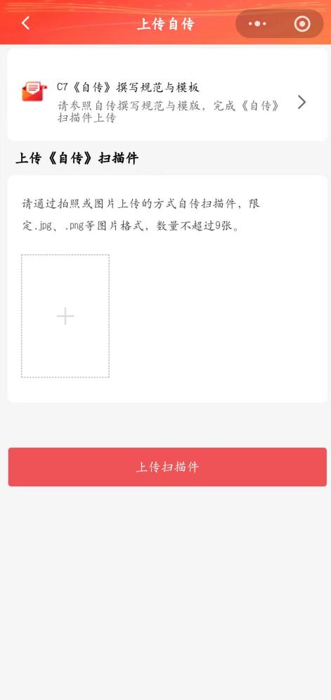

### 党校培训

#### 学院党委管理员（PC端）

党校培训操作同【第二节 入党积极分子的确定和培养教育阶段-培育考察】一致，参考流程图如下：

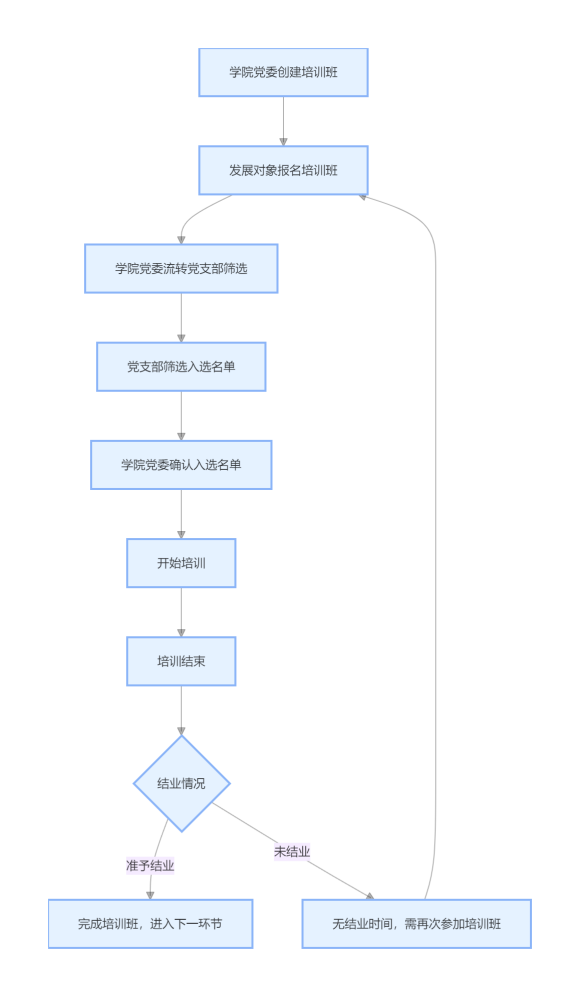

创建发展对象培训班，设置报名时间、支部名额及发布范围→确认支部上报的入选名单并推送通知→培训结束后，确定结业情况（结业/未结业）。

##### 创建并发布发展对象培训班

1.  进入【培训管理】页，点击"创建培训班"按钮，进入【培训管理-详情】页；

2.  填写培训班基础信息，注意培训班类型选择"发展对象培训班"，分配支部名额后滑到最底下点击"保存并发布"按钮完成培训班创建。

**补充事项**

1.  未到报名时间，培训班状态为：待开始；

2.  到达报名时间，培训班状态变为：报名中。

##### 流转支部筛选

到达报名截止时间，点击"流转支部筛选"按钮，等待支部返回入选名单。

##### 确认入选名单

1.  支部提交入选名单至学院党委后，点击"确认入选名单"确认入选名单。

2.  进入【培训管理-详情】页后，待所有支部提交入选名单后，点击"确认入选名单"完成最终名单确认，培训班进入"待培训"状态，入选结果同步至发展对象。

##### 开始培训

点击"开始培训"按钮，培训班状态变为：培训中。培训班状态同步至发展对象。

##### 结束培训

到达培训截止时间后，培训班结束，也可手动点击"结束培训"按钮提前结束培训班。

##### 确认培训结果

培训班结束后，填写结业时间和结业情况，点击"确认培训结果"完成培训班，培训结果同步至发展对象。结业情况选择：未结业。则无结业时间，发展对象需再次参加培训班直至准予结业。

#### 党支部管理员（PC端）

##### 确认发展对象培训班入选名单

1.  学院党委点击"流转支部筛选"按钮后，党支部可进入【培训管理】页面，选择培训班状态为："支部筛选中"，点击"筛选报名名单"进入【培训管理-详情】页面；

2.  确认入选名单，点击"提交党委"按钮可将入选名单推送至学院党委。

**补充事项**

1.  点击报名发展对象的上移、下移操作可调整入选顺序；

2.  支部报名人数小于等于支部名额，默认所有报名发展对象全部入选。

## 预备党员的接收阶段

### 确定符合条件的发展对象

#### 党支部管理员（PC端）

1.  进入【预备党员接收】列表，选择所要审核发展条件的发展对象，点击其操作栏的"审核通过"/"审核不通过"按钮完成发展条件审核；

2.  点击"审核不通过"后，申请人状态变为：发展条件-不通过。可点击"重新发展"按钮回退预备党员接收阶段初始状态重新发展；

3.  完成发展条件审核后，点击"流转推优流程"进入推优环节。

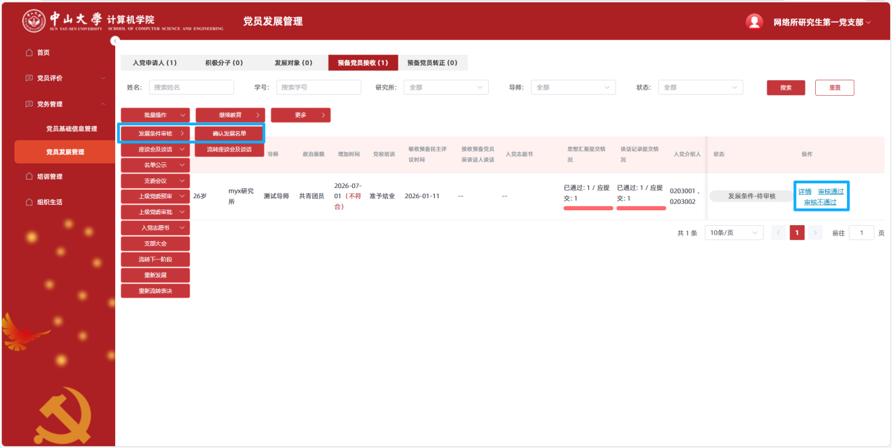

### 流转座谈会及谈话

非本学期备案的发展对象，除了需要完成接收预备党员前谈话外，还需额外完成一次座谈会。

#### 入党介绍人（小程序端）

安排谈话日程并上传谈话记录操作同【第二节 入党积极分子的确定和培养教育阶段-[[培育考察]{.underline}](#培育考察)】一致，参考流程图如下：

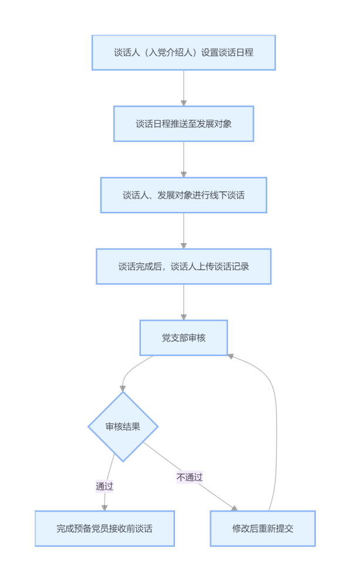

##### 安排谈话日程并上传谈话记录

1.  点击待办事项的培育考察-接收预备党员前谈话的"安排"按钮，安排谈话地点和谈话时间；

2.  安排谈话日程后，点击待办事项的培育考察-接收预备党员前谈话"详情"按钮，确认谈话人信息后填写并上传谈话记录至的支部；

3.  等待支部返回审核结果。

**补充事项**

1.  在谈话记录页面可点击"谈话内容参考框架.docx"查看参考文件；

2.  党支部管理员审核前，支持自行撤回上传操作；

3.  审核结果不通过的，可按退回原因修改后重新提交。

#### 党支部管理员（PC端）

##### 审核接收预备党员前谈话

1.  进入【预备党员接收】列表，选择所要审核谈话的发展对象，点击其操作栏的"查看谈话记录"按钮（或者点击批量操作按钮）进入【审核谈话记录】页；

    

2.  点击左侧发展对象列表，右侧同步展示该发展对象基本信息以及谈话记录；

3.  确定谈话记录审核结果。点击"审核通过"，完成谈话记录审核；选择"审核不通过"，需填写审核不通过说明；

4.  审核结果同步至入党介绍人。若审核不通过，入党介绍人可重新提交谈话记录直至审核通过。

##### 安排并完成座谈会

1.  进入【预备党员接收】列表，选择所要安排座谈会的发展对象，点击其操作栏的"查看座谈会记录"按钮（或者点击批量操作按钮）进入【批量操作-流转-座谈会管理】页；

2.  进入【批量操作-流转-座谈会管理】页，填写座谈会时间、地点；

3.  点击"批量导出记录表扫描件"导出《入党重点发展对象群众意见原始记录表》（系统已自动填入基本信息）；

4.  点击"批量上传记录"（或者单个上传），上传填写完成的《入党重点发展对象群众意见原始记录表》

5.  点击"完成座谈会"按钮完成座谈会，进入下一阶段。

**补充事项**

1.  批量导出、上传座谈会记录表时均需勾选列表中的发展对象；

2.  批量上传时，必须严格按照文件名称格式（姓名+学号），否是无法识别文件。

### 预备党员接收公示

#### 党支部管理员（PC端）

完成座谈会和接收前谈话后，确定公示名单→启动公示流程→公示期结束后生成公示文件→生成公示报告，完成公示。公示无异议则推进下一阶段，并推送公示结果给发展对象。

1.  点击"公示管理"按钮进入公示管理页面；

    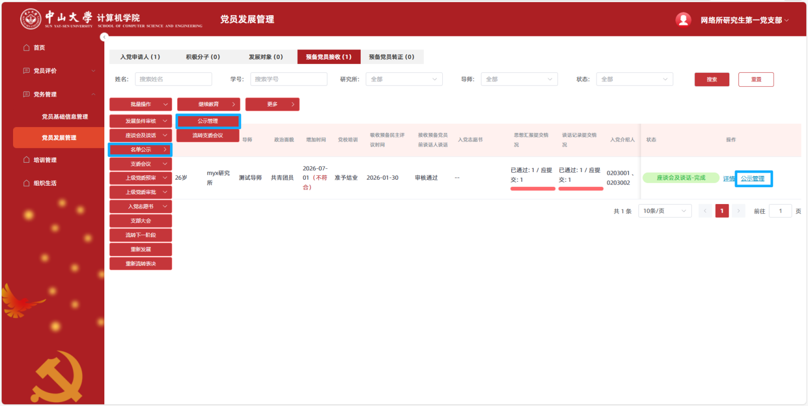

2.  点击"新增公示"按钮，新增一条预备党员接收公示，按钮公示流程完成公示。

公示流程同【第六章 党员发展管理-第一节 入党申请阶段-[[申请人公示]{.underline}](#申请人公示)】，公示流程参考如下图：

### 支委会议

#### 党支部管理员（PC端）

组织线下支委会议→会议结束后在系统上填报会议时间。

1.  进入【预备党员接收】列表，选择所要完成支委会议的发展对象，点击其操作栏的"支委会议管理"按钮（或者点击批量操作按钮）；

    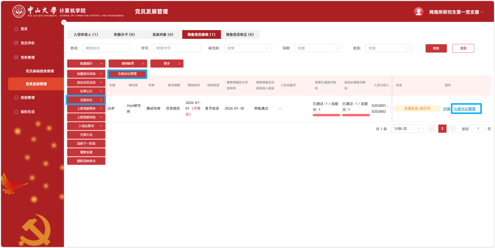

2.  进入【批量操作-流转-填报支委会议时间】页，填报会议时间；

3.  点击"确定"按钮完成支委会记录，进入下一阶段。

### 上级党委预审

#### 党支部管理员（PC端）

创建预审表，确定发展对象信息，将预审表提交至学院党委。

1.  点击"预审管理/审批管理"按钮，进入【上级党委预审】页面；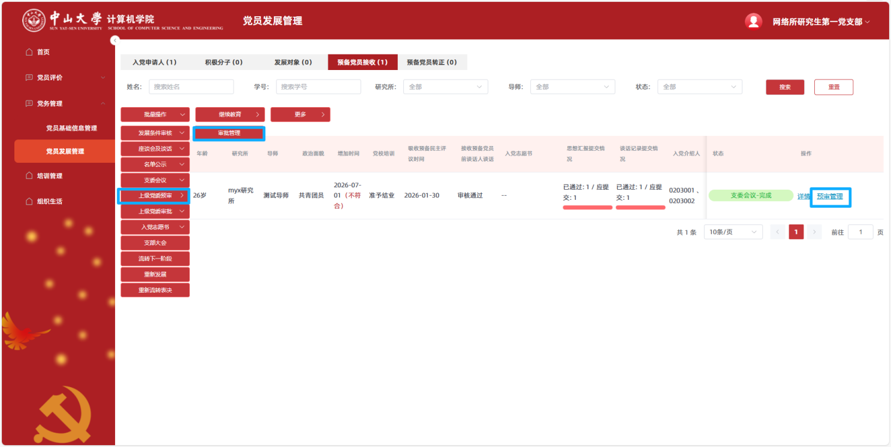

2.  点击"新增预审"按钮，新增一条预审记录。

##### 确认名单

1.  填写发展对象的预审结果（通过/不通过）、选择上报时间；

2.  勾选发展对象名单，点击"确认并生成预审表"。

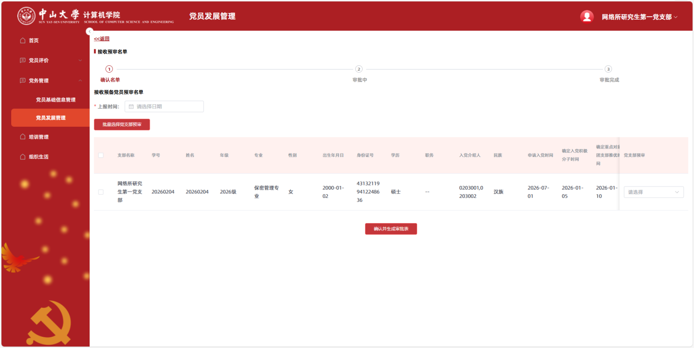

##### 提交预审表

1.  点击"提交审批"，将预审表提交至学院党委审批。

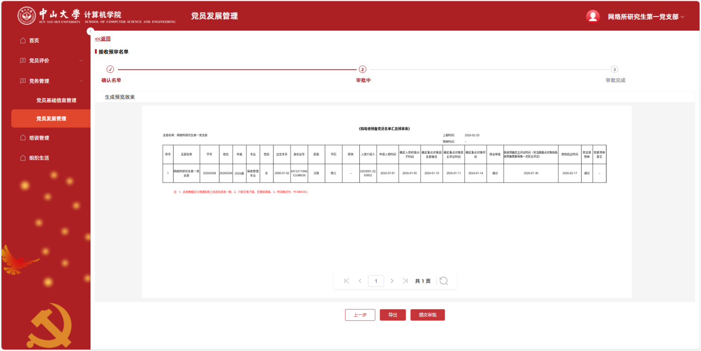

#### 学院党委管理员（PC端）

对党支部提交的材料进行严格审查，确认发展对象具备接收条件、手续齐全后，在系统上填写党委会审批时间、审批意见，完成预审工作。

##### 确认预审结果

1.  进入【预备党员接收】列表，选择所要完成预审的发展对象，点击其操作栏的"预审管理"按钮（或者点击批量操作按钮）；

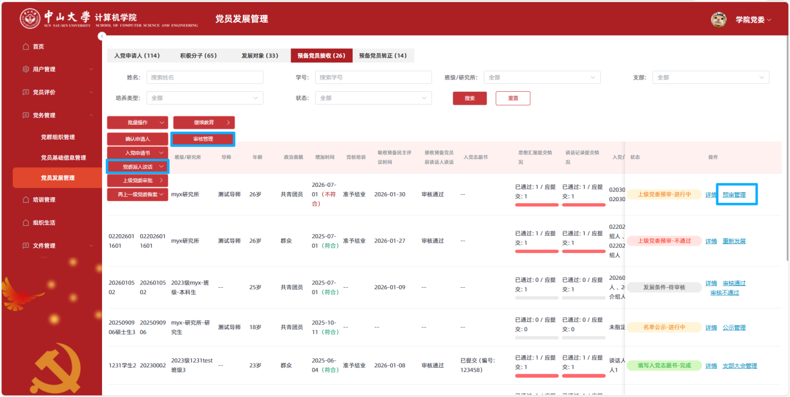

2.  进入【上级党委预审】管理页面，选择状态为"审批中"的预审记录，点击"详情"按钮进入审批完成页面；

3.  填写发展对象的党委审批意见，选择审批时间；

4.  点击"确认审批结果"按钮完成上级党委预审，预审通过的发展对象进入下一环节。

**补充事项**

1.  党委点击"确认审批结果"后，若党支部预审选择"不通过"，发展对象状态变为：上级党委预审-不通过。可点击"重新发展"按钮回退至从预备党员接收阶段初始状态重新发展。

### 入党志愿书管理

#### 学院党委管理员（PC端）

##### 分配入党志愿书

1.  点击"分配入党志愿书编号"，进入分配入党志愿书页面；

    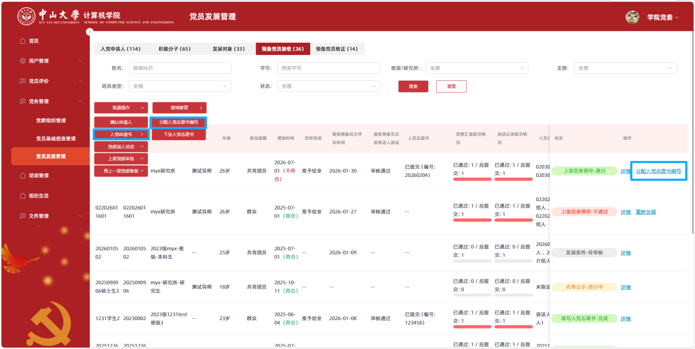

2.  为发展对象分配入党志愿书编号（不可重复），点击"确定"按钮完成入党志愿书编号分配。

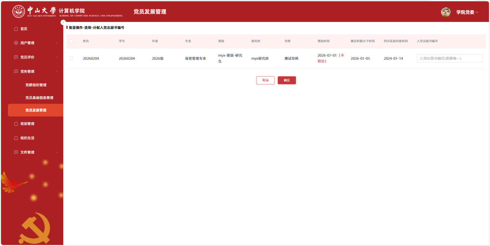

##### 下发入党志愿书

点击"下发入党志愿书"，发展对象接收到入党志愿书填写通知。

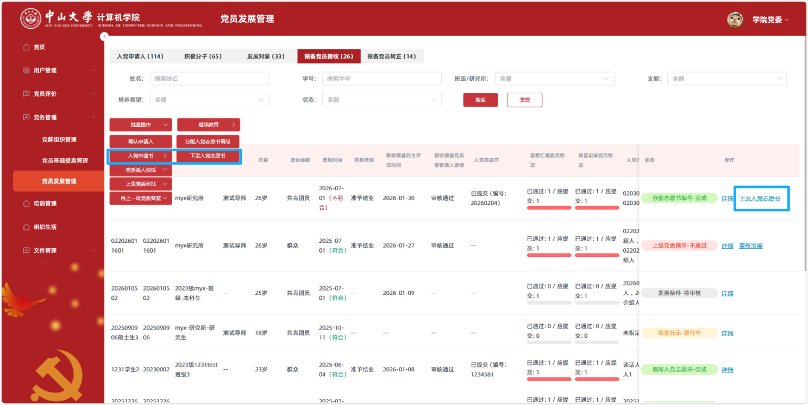

#### 发展对象（小程序端）

##### 查看入党志愿书编号、填写模版

点击"详情"查看入党志愿书编号以及入党志愿书填写模版，线下完成入党志愿书并提交至党支部。

 

#### 党支部管理员（PC端）

##### 确认入党志愿书提交

点击"确认提交/确认志愿书提交"按钮，线上登记发展对象是否提交入党志愿书，无需上传。

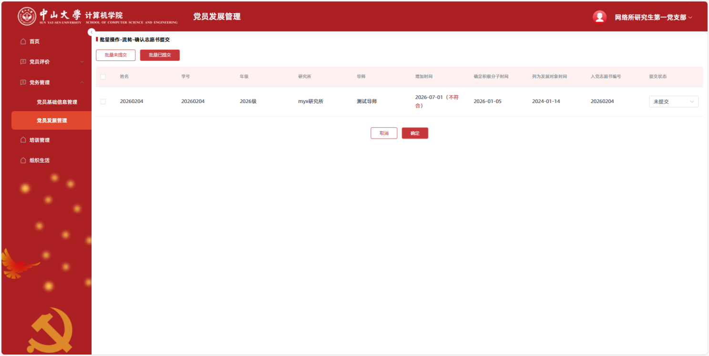

### 支部大会讨论

#### 党支部管理员（PC端）

##### 设置基本信息

创建支部大会→导出表决票模版→填写会议基本信息→线下召开支部大会→记录会议记录和表决结果。其他组织生活会操作同理。

1.  点击"支部大会管理/支部大会"按钮进入支部大会管理，或者点击"组织生活"进入；

2.  点击"创建组织生活"按钮，进入【设置基本信息】页面。

3.  填写会议基础信息，注意类型选择"党员大会"、是否含投票表决选择"是"、表决内容选择"接收预备党员会议"。其他字段可自行填写；

**补充事项**

1.  "发布范围"影响参会名单，如选择仅"支部内均可参加"，则该支部内的参与表决人员、积极分子、发展对象、预备党员、正式党员均可参加；如选择"仅党员（预备党员、党员参加）"，则只有该支部的参与表决人员、预备党员和正式党员可参加。

2.  "是否含投票表决"影响表决内容与表决人员名单，如选择"是"，则需选择表决内容、表决人员名单；如选择"否"，则无需填写表决内容、表决人员名单。

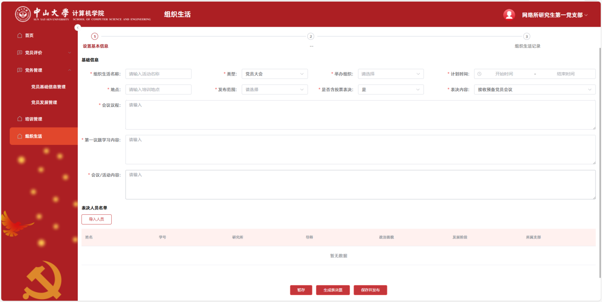

3.  点击表决人员名单的"导入人员"按钮，选择表决人员，点击"确定"按钮；

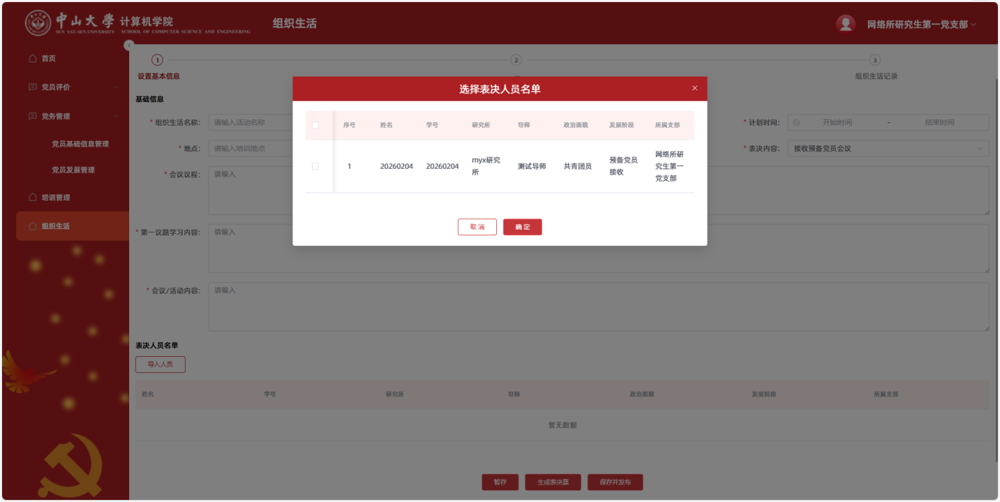

4.  点击"生成表决票"可导出表决票模版，确定基本信息填写完毕后点击"保存并发布"按钮发布会议。

##### 会议进行中

会议开始后，自动生成签到码和签退码，点击对应按钮即可查看二维码。

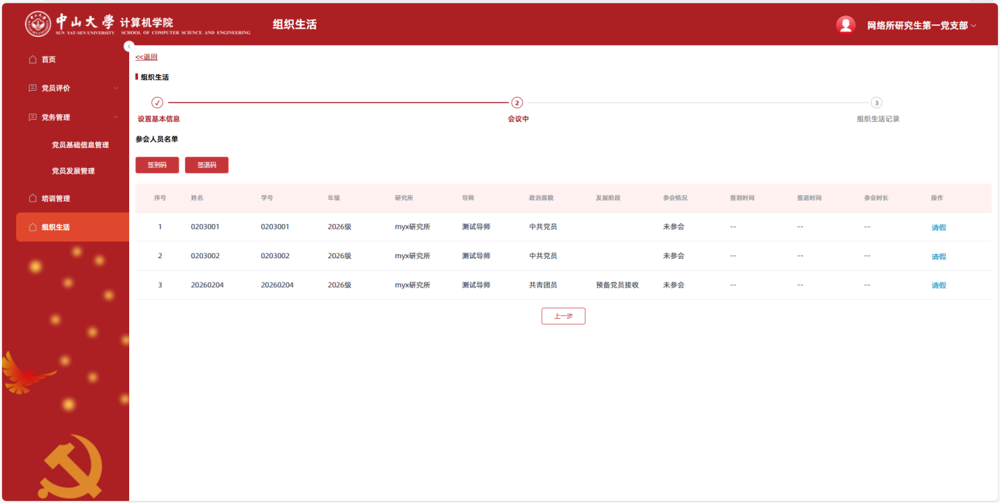

##### 会议结束

1.  会议结束后，可根据实际参会情况，进行补录、或请假操作，未签到、签退、请假的，视为缺席。参会情况同步至参会人；

2.  点击"确认参会名单"按钮，进入组织生活记录。

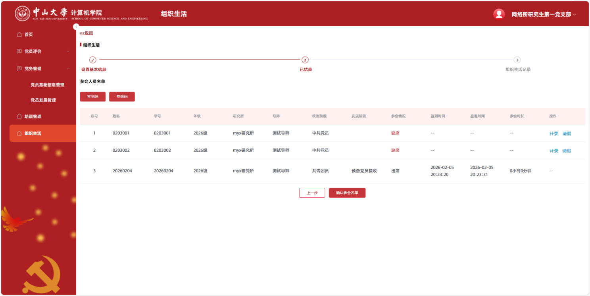

##### 组织生活记录

填写表决结果，点击"确定记录"按钮完成支部大会。

**补充事项**

若选择发展对象的表决结果为"不同意接收"，发展对象状态变为：支部大会-不通过。可点击"重新流转表决"按钮回退至支部大会前一步骤，可重新参加支部大会。

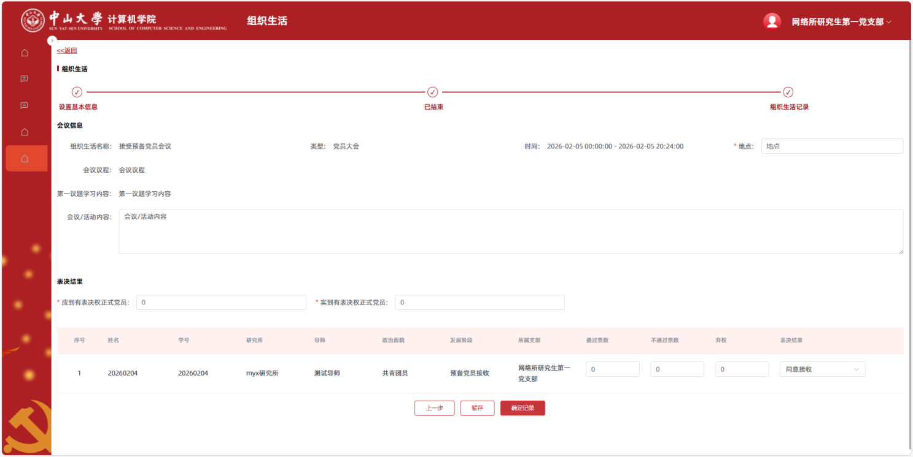

#### 发展对象（小程序端）

##### 参加支部大会

会议发布后，参会人员可在小程序端的组织页面查看组织生活情况，在会议期间可扫描二维码进行签到签退。

**补充事项**

1.  未签到时，扫描签退二维码无效；

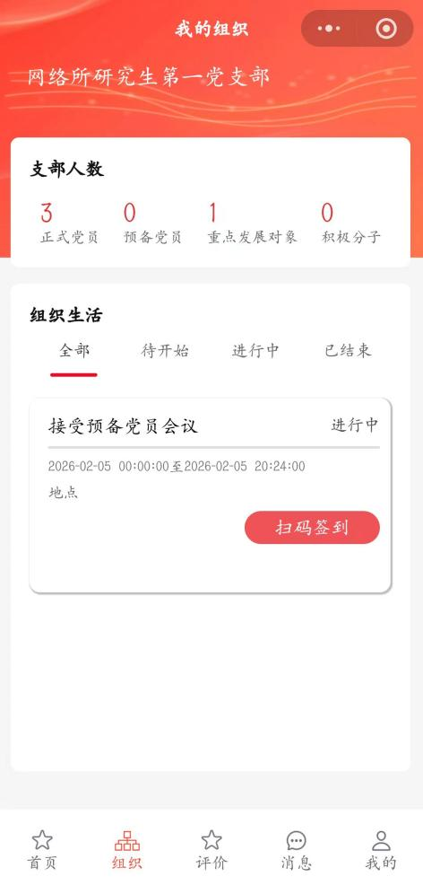

### 上级党委派人谈话

#### 学院党委管理员（PC端）

##### 指派谈话人

1.  点击"指派谈话人"进入【批量操作-流转-上级党委派人谈话管理】页面；

2.  为预备党员指派谈话人，点击"确定"按钮完成指派。

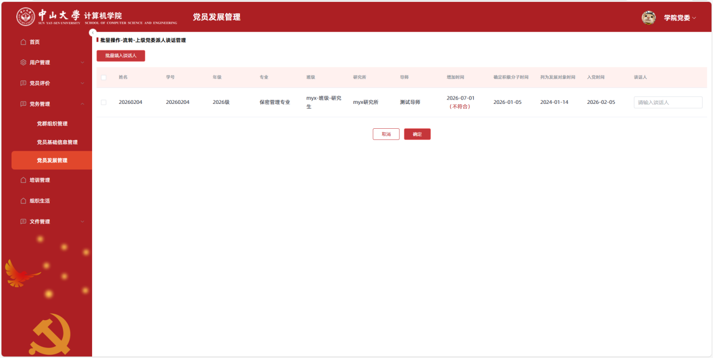

##### 流转党委派人谈话

点击"流转党委派人谈话"，发送党委谈话待办事项至预备党员。

##### 确认谈话

1.  点击"确认谈话"进入【批量操作-流转-党委确认谈话】页面；

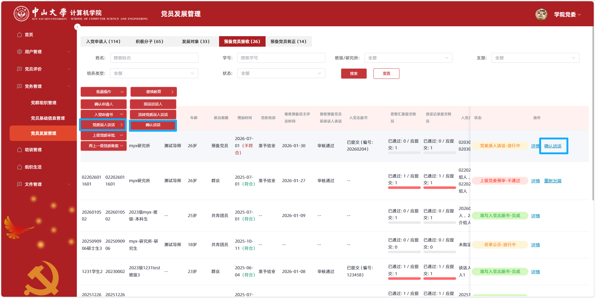

2.  查看预备党员提交的谈话时间，也可对预备党员提交的谈话时间进行修改，确认无误后点击"确定"按钮完成上级党委派人谈话操作，流转下一环节。

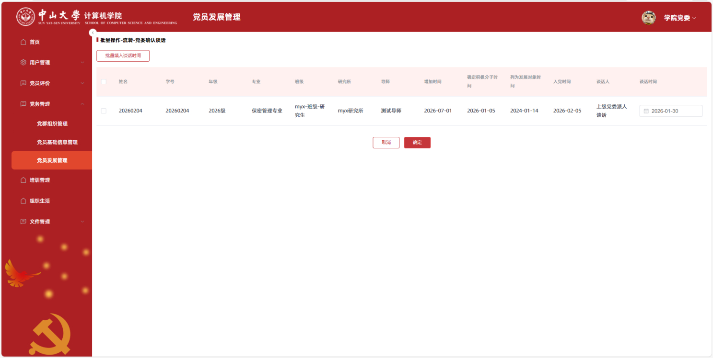

#### 预备党员（小程序端）

##### 填写谈话时间

1.  党委流转谈话后，点击待办事项-上级党委派人谈话的"详情"按钮进入【党委谈话】页面；

2.  点击查看党员谈话意见参考，选择谈话时间，点击"提交"按钮提交至党委。

    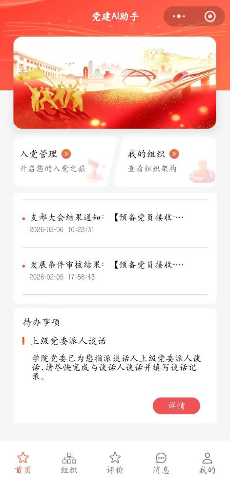 

### 上级党委审批

#### 党支部管理员（PC端）

创建审批表，确定预备党员信息，将审批表提交至学院党委。

1.  点击"审批管理"按钮，进入【上级党委审批】页面；

    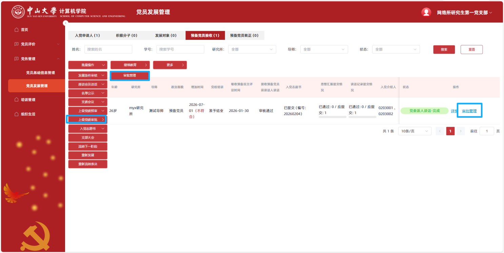

2.  点击"新增审批"按钮新增一条审批记录；

##### 确认名单

3.  选择上报时间；

4.  勾选预备党员名单，点击"确认并生成审批表"；

    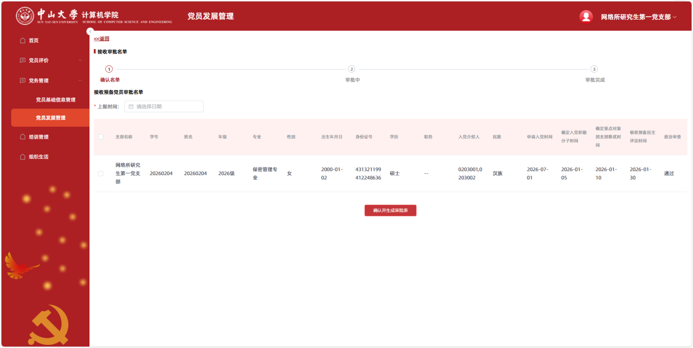

##### 提交审批表

5.  点击"提交审批"，将审批表提交至学院党委审批；

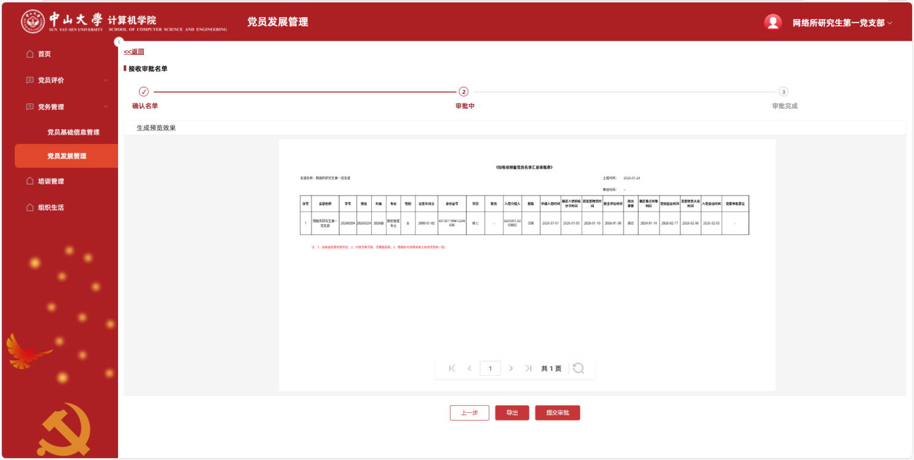

#### 学院党委管理员（PC端）

对党支部提交的材料进行严格审查，确认预备党员具备接收条件、手续齐全后，在系统上填写党委会上报时间、审批时间、审批意见，完成审批工作。

##### 确认审批结果

1.  点击"审批管理"按钮，进入【上级党委审批】页面；

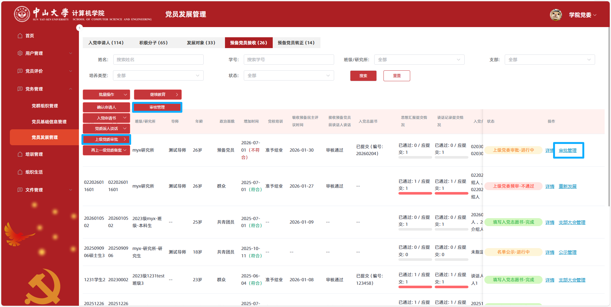

1.  选择状态为"审批中"的审批记录，点击"详情"按钮进入审批完成页面；

2.  填写预备党员的党委审批意见，选择审批时间；

3.  点击"确认审批结果"按钮完成上级党委审批，预备党员进入下一环节。

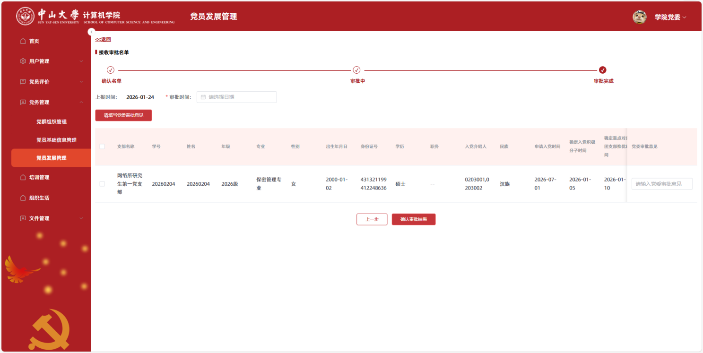

### 再上一级党委组织部门备案

将预备党员相关信息及审批材料，上报至再上一级党委组织部门，完成备案工作。

1.  点击"再上一级党委备案/备案管理"按钮进入【党委备案】页面

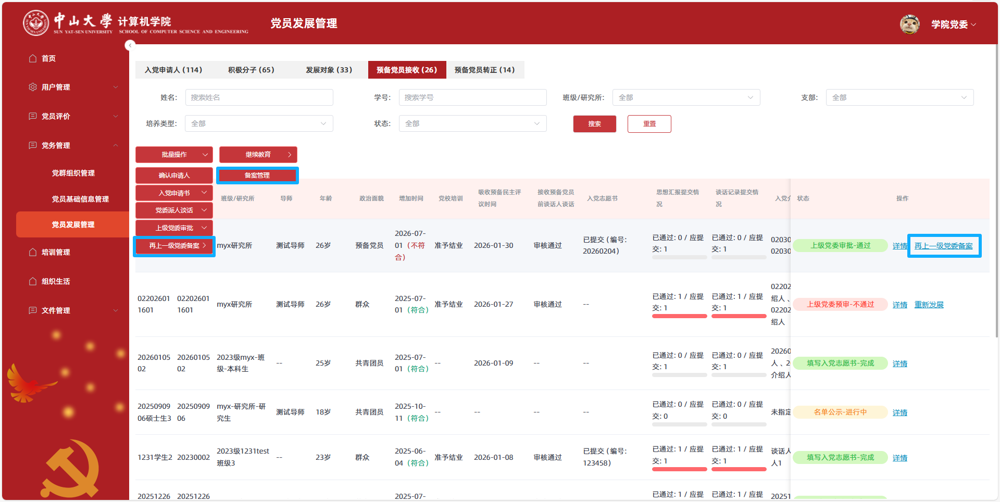

2.  点击"新增备案"按钮，新增一条再上一级党委组织部门备案记录；

3.  新增备案后，点击"详情"按钮进入【确认名单】页；

4.  选择备案填表时间，勾选预备党员名单，点击"确认并生产备案表"按钮，进入待提交备案状态；

    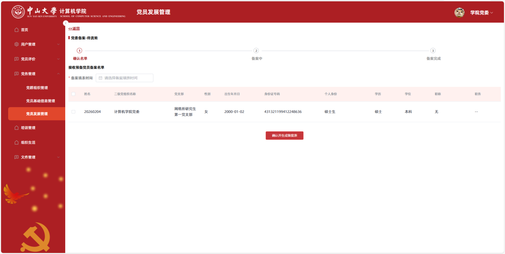

5.  生成备案表后，点击"提交备案"按钮，进入备案中状态；

    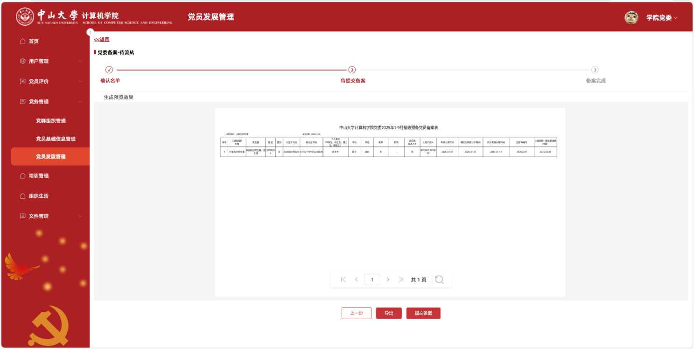

6.  选择备案时间、填写备案说明（选填）后，点击"确认备案结果"按钮完成备案操作，进入下一阶段。

    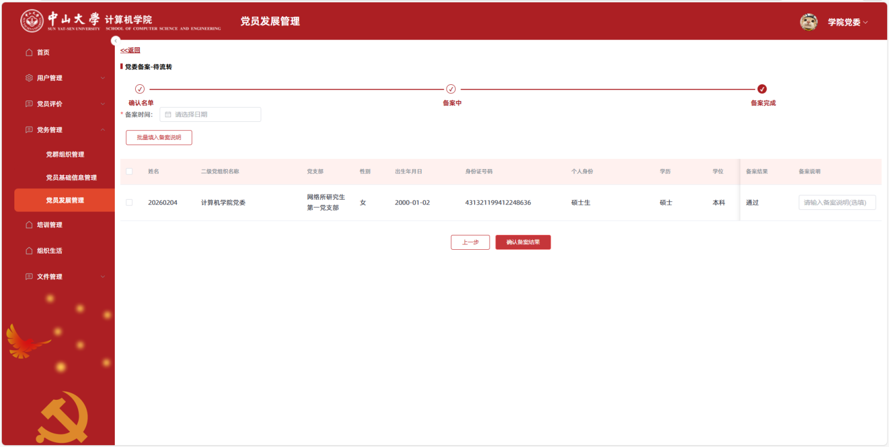

## 预备党员的教育考察和转正

### 编入党支部和党小组

#### 党支部管理员（PC端）

将预备党员编入党小组，明确其所在的党支部和党小组信息，并通知预备党员其编入的党小组。

1.  点击"编入党小组"按钮，进入【批量操作-流转-编入党小组】页面；

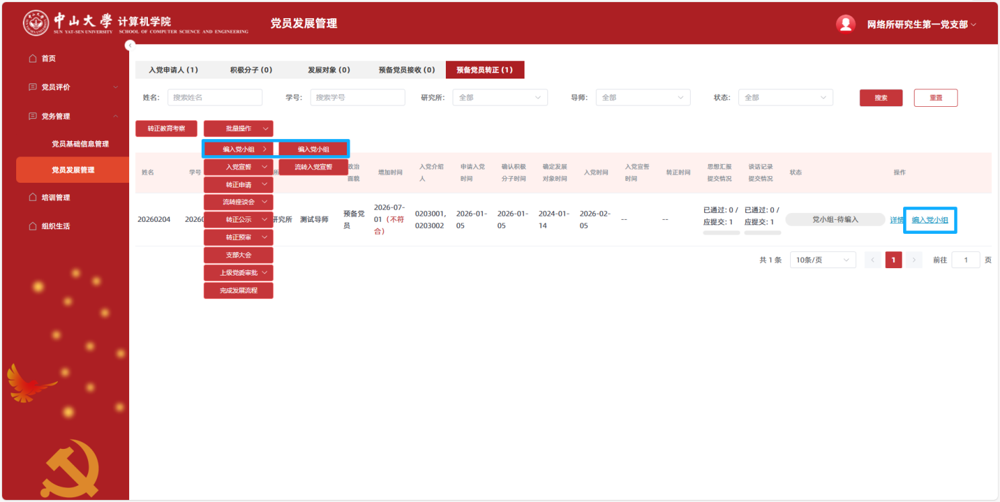

2.  为预备党员选择党小组（党小组由学院党委添加），点击"确定"按钮完成党小组编入；

### 入党宣誓

#### 党支部管理员（PC端）

##### 流转入党宣誓

1.  点击"流转入党宣誓"按钮，完成入党宣誓流转；

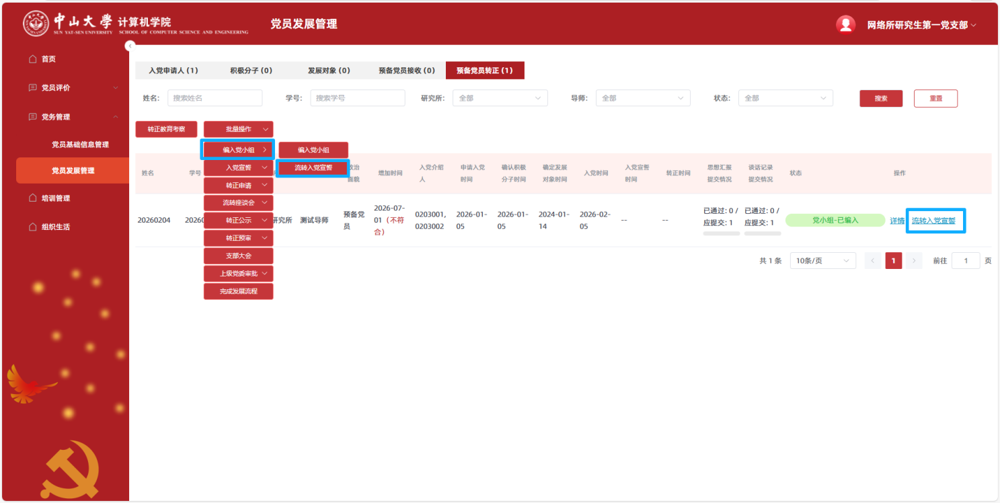

##### 填写宣誓时间

2.  点击"填写宣誓时间"按钮进入【批量操作-流转-入党宣誓时间】页面；

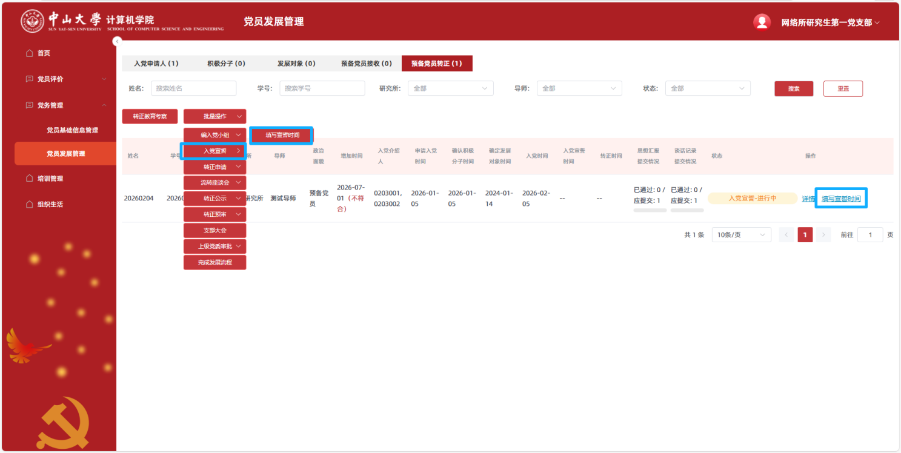

3.  填入入党宣誓时间，完成填写后点击"确定"按钮完整入党宣誓，流转下一环节。

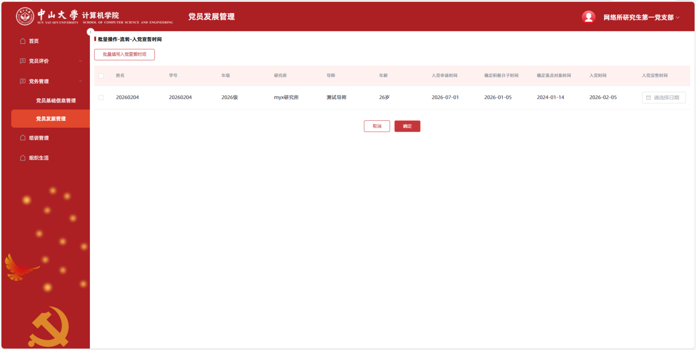

### 转正教育考察

转正教育考察操作同【第二节 入党积极分子的确定和培养教育阶段-[[培育考察]{.underline}](#培育考察)】一致，参考流程图如下：

#### 预备党员（小程序端）

##### 上传思想汇报

思想汇报：每季度上传1篇，一年共4篇；审核不通过可修改后重新提交；

1.  点击待办事项-培育考察的"详情"按钮，进入培育考察页面；

2.  点击思想汇报卡片的"查看记录"，点击"立即提交"按钮即可进入提交思想汇报页面；

3.  点击查看思想汇报规范，点击上传思想汇报图片，点击"提交"按钮完成思想汇报上传。

**补充事项**

1.  党支部管理员审核前，支持自行撤回上传操作；

2.  审核结果不通过的，可按退回原因修改后重新提交。

##### 查看季度谈话

每季度与入党介绍人线下谈话，提醒入党介绍人上传谈话记录表，确认本季度谈话完成。

1.  点击待办事项-培育考察的"详情"按钮，进入培育考察页面；

2.  点击思想汇报季度谈话卡片的"查看记录"，查看季度谈话提交情况。

#### 入党介绍人（小程序端）

每季度与发展对象线下谈话，上传谈话记录表，确认本季度谈话完成。

##### 安排谈话日程并上传谈话记录

1.  点击待办事项的培育考察-季度谈话"安排"按钮，安排谈话地点和谈话时间；

2.  安排谈话日程后，点击待办事项的培育考察-季度谈话"详情"按钮，确认谈话人信息后填写并上传谈话记录至的支部；

3.  等待支部返回审核结果。

**补充事项**

1.  在谈话记录页面可点击"谈话内容参考框架.docx"查看参考文件；

2.  党支部管理员审核前，支持自行撤回上传操作；

3.  审核结果不通过的，可按退回原因修改后重新提交。

#### 党支部管理员（PC端）

监督发展对象各项任务完成情况→审核思想汇报、接收谈话记录→对未按时完成任务的预备党员发出教育提醒→对完成所有考察内容的预备党员，流转至下一阶段。

进入【预备党员接收】列表，选择所要审核培育考察任务的预备党员，点击其操作栏的"查看考察进度"按钮进入【培育考察】页（或者点击培育考察按钮）。

##### 审核思想汇报

进入【培育考察】页，点击"审核思想汇报"按钮进入批量审核页面，或点击预备党员操作列的"详情"按钮进入个人审核页面。

**批量审核：**

1.  点击"审核思想汇报"进入批量审核页面，点击左侧预备党员列表，右侧同步展示该预备党员基本信息以及思想汇报；

2.  确定思想汇报审核结果。点击"审核通过"，完成思想汇报审核并进入下一环节；选择"审核不通过"，需填写审核不通过说明；

3.  审核结果同步至发展对象。若审核不通过，预备党员可重新提交思想汇报直至审核通过；

**补充事项**

1.  思想汇报催交。点击"催交"按钮，可发送催交消息至未提交思想汇报或思想汇报审核不通过的预备党员。

    **单个审核：**

<!-- -->

1.  点击预备党员操作列的"详情"按钮进入【培育考察-详情】页面；

2.  点击思想汇报卡片的"详情"按钮，展示该预备党员提交的思想汇报；

3.  确定思想汇报审核结果。点击"审核通过"，完成思想汇报审核并进入下一环节；选择"审核不通过"，需填写审核不通过说明；

4.  审核结果同步至预备党员。若审核不通过，预备党员可重新提交思想汇报直至审核通过。

##### 审核谈话记录

进入【培育考察】页，点击"审核谈话记录"按钮进入批量审核页面，或点击预备党员操作列的"详情"按钮进入个人审核页面。

**批量审核：**

1.  点击"审核谈话记录"进入批量审核页面，点击左侧预备党员列表，右侧同步展示该预备党员基本信息以及谈话记录；

2.  确定谈话记录审核结果。点击"审核通过"，完成谈话记录审核并进入下一环节；选择"审核不通过"，需填写审核不通过说明；

3.  审核结果同步至入党介绍人。若审核不通过，入党介绍人可重新提交谈话记录直至审核通过；

**补充事项**

1.  谈话记录催交。点击"催交"按钮，可发送催交消息至未提交谈话记录或谈话记录审核不通过的预备党员。

    **单个审核：**

<!-- -->

1.  点击预备党员操作列的"详情"按钮进入【培育考察-详情】页面；

2.  点击谈话记录卡片的"详情"按钮，展示该预备党员提交的谈话记录；

3.  确定谈话记录审核结果。点击"审核通过"，完成谈话记录审核并进入下一环节；选择"审核不通过"，需填写审核不通过说明；

4.  审核结果同步至入党介绍人。若审核不通过，入党介绍人可重新提交谈话记录直至审核通过。

##### 考察通过

所有培训任务完成且通过后，点击"考察通过"完成预备党员结束阶段的培育考察，流转下一阶段。

### 提出转正申请

#### 党支部管理员（PC端）

##### 开放转正申请

点击"开放转正申请"按钮，开放预备党员转正申请入口。

##### 处理转正申请

1.  点击"处理转正申请"按钮，进入【批量操作-流转-转正申请确认】页面；

2.  查看转正申请书，填写时间，确认申请书提交结果后，点击"确定"按钮完成转正申请，进入下一环节。

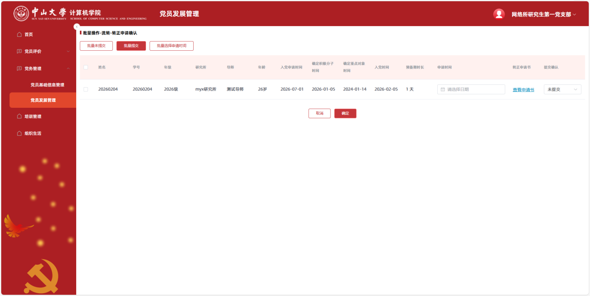

#### 预备党员（小程序端）

##### 提交转正申请

1.  点击待办事项-转正申请的"详情"按钮，进入【转正申请】页面；

2.  查看转正申请撰写规范与模版，上传转正申请书，点击"上传扫描件"按钮完成转正申请书上传。

    **补充事项**

<!-- -->

1.  党支部管理员审核前，支持自行撤回上传操作；

2.  审核结果不通过的，可按退回原因修改后重新提交。

    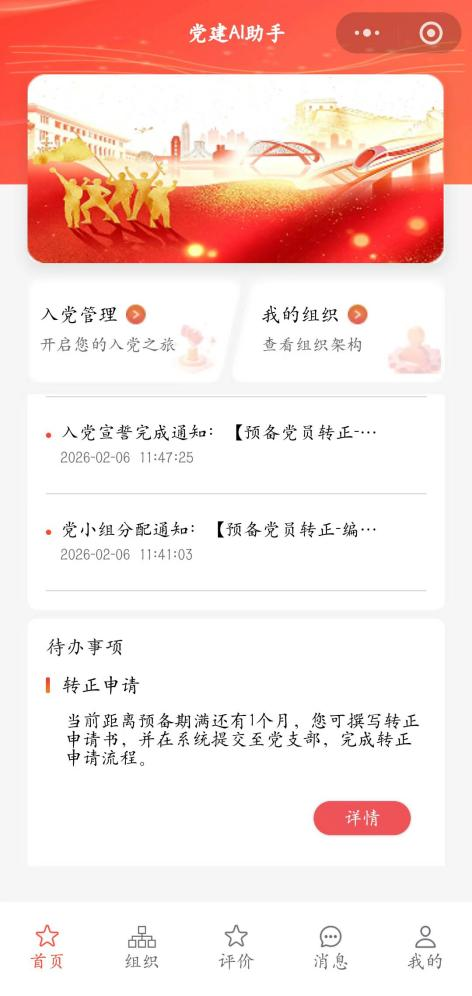 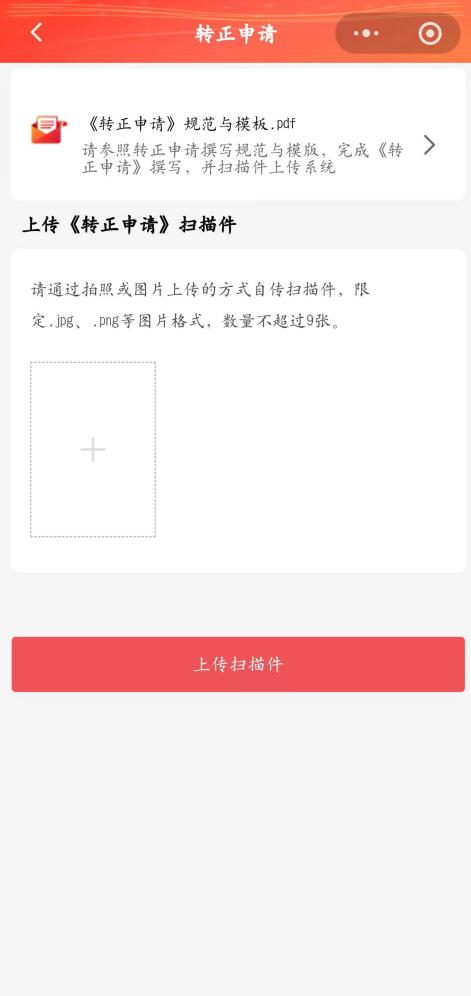

### 座谈会管理

#### 党支部管理员（PC端）

点击"流转座谈会"按钮，流转座谈会，进入座谈会管理；

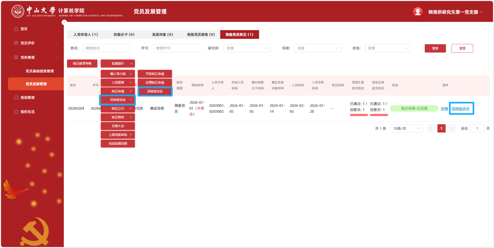

安排并完成座谈会操作同【第三节 第三节入党重点发展对象的确定和培养教育阶段-入党重点发展对象座谈会-党支部管理员（PC端）】一致，这里不再附图说明。

1.  进入【批量操作-流转-座谈会管理】页，填写座谈会时间；

2.  点击"批量导出记录表扫描件"导出《拟转正预备党员民主评议意见原始记录表》（系统已自动填入基本信息）；

3.  点击"批量上传记录"（或者单个上传），上传填写完成的《拟转正预备党员民主评议意见原始记录表》；

4.  点击"完成座谈会"按钮完成座谈会，进入下一环节。

**补充事项**

1.  批量导出、上传座谈会记录表时均需勾选列表中的预备党员；

2.  批量上传时，必须严格按照文件名称格式（姓名+学号），否是无法识别文件。

### 预备党员转正公示

#### 党支部管理员（PC端）

完成座谈会后，确定公示名单→启动公示流程→公示期结束后生成公示文件→生成公示报告，完成公示。公示无异议则推进下一环节，并推送公示结果给预备党员。

1.  点击"进入公示/公示管理"按钮进入公示管理页面

2.  点击"新增公示"按钮，新增一条预备党员转正公示，按照公示流程完成公示。

    公示流程同【第六章 党员发展管理-第一节 入党申请阶段-[[申请人公示]{.underline}](#申请人公示)】，公示流程参考如下图：

    

### 上级党委预审

上级党委预审操作同【第四节 预备党员的接收阶段-[[上级党委预审]{.underline}](#上级党委预审)】一致，流程图参考如下：

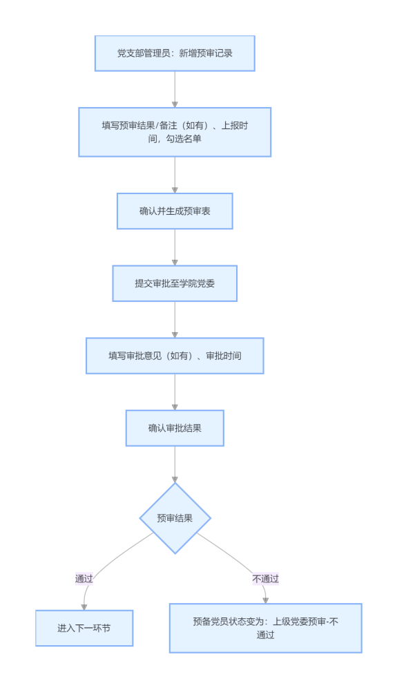

#### 党支部管理员（PC端）

创建预审表，确定发展对象信息，将预审表提交至学院党委。

1.  点击"进入转正预审/预审管理"按钮，进入【上级党委预审】页面；

    

2.  点击"新增预审"按钮，新增一条预审记录；

##### 确认名单

3.  填写预备党员的预审备注（选填）、选择上报时间；

4.  勾选预备党员名单，点击"确认并生成预审表"；

##### 提交预审表

5.  点击"提交审批"，将预审表提交至学院党委审批；

#### 学院党委管理员（PC端）

对党支部提交的材料进行严格审查，确认预备党员具备接收条件、手续齐全后，在系统上填写党委会审批时间、党委审批意见，完成预审工作。

##### 确认预审结果

1.  点击"预审管理"按钮，进入【上级党委预审】页面；

    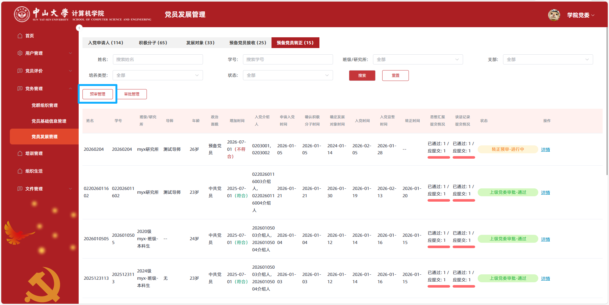

2.  选择状态为"审批中"的预审记录，点击"详情"按钮进入审批完成页面；

3.  填写预备党员的党委审批意见，选择审批时间；

4.  点击"确认审批结果"按钮完成上级党委预审，预审通过的预备党员进入下一环节。

### 支部大会讨论

支部大会讨论操作同【第四节 预备党员的接收阶段-支部大会讨论】一致，这里不再附图说明。

#### 党支部管理员（PC端）

##### 设置基本信息

创建支部大会→导出表决票模版→填写会议基本信息→线下召开支部大会→记录会议记录和表决结果。其他组织生活会操作同理。

1.  点击"进入支部大会/支部大会"按钮进入支部大会管理，或者点击"组织生活"进入；

2.  点击"创建组织生活"按钮，进入【设置基本信息】页面。

3.  填写会议基础信息，注意类型选择"党员大会"、是否含投票表决选择"是"、表决内容选择"预备党员转正"。其他字段可自行填写。

**补充事项**

1.  "发布范围"影响参会名单，如选择仅"支部内均可参加"，则该支部内的参与表决人员、积极分子、发展对象、预备党员、正式党员均可参加；如选择"仅党员（预备党员、党员参加）"，则只有该支部的参与表决人员、预备党员和正式党员可参加；

2.  "是否含投票表决"影响表决内容与表决人员名单，如选择"是"，则需选择表决内容、表决人员名单；如选择"否"，则无需填写表决内容、表决人员名单；

3.  点击表决人员名单的"导入人员"按钮，选择表决人员，点击"确定"按钮；

4.  点击"生成表决票"可导出表决票模版，确定基本信息填写完毕后点击"保存并发布"按钮发布会议。

##### 会议进行中

1.  会议开始后，自动生成签到码和签退码，点击对应按钮即可查看二维码。

##### 会议结束

1.  会议结束后，可根据实际参会情况，进行补录、或请假操作，未签到、签退、请假的，视为缺席。参会情况同步至参会人；

2.  点击"确认参会名单"按钮，进入组织生活记录。

##### 组织生活记录

1.  填写表决结果，点击"确定记录"按钮完成支部大会。

**补充事项**

1.  若选择预备党员的表决结果为"同意转正"，则进入下一环节；

2.  若选择预备党员的表决结果为"延迟预备期半年/延迟预备期一年"，则预备党员状态回退至上一阶段，可再次参加支部大会；

3.  若选择预备党员的表决结果为"不同意接收"，预备党员状态变为：支部大会-不通过，不可重新发展。

#### 发展对象（小程序端）

##### 参加支部大会

会议发布后，参会人员可在小程序端的组织页面查看组织生活情况，在会议期间可扫描二维码进行签到签退。

**补充事项**

1.  未签到时，扫描签退二维码无效；

### 上级党委审批

上级党委审批操作同【第四节 预备党员的接收阶段-[[上级党委审批]{.underline}](#上级党委审批)】一致，流程图参考如下：。

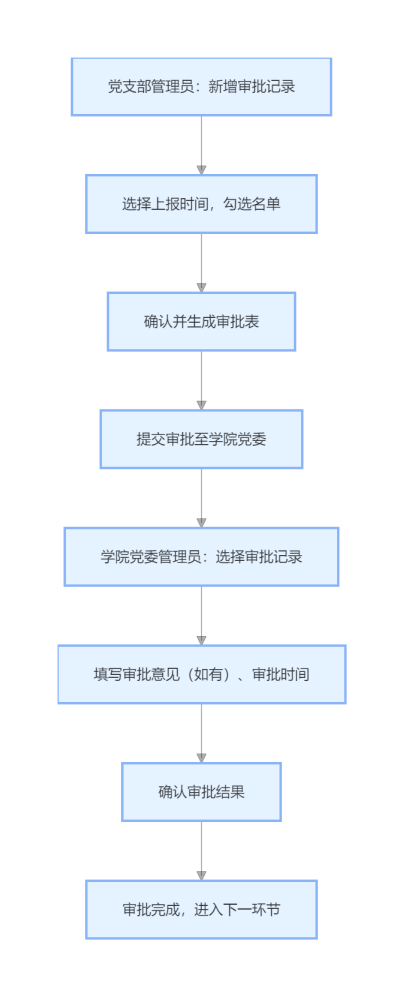

#### 党支部管理员（PC端）

创建审批表，确定正式党员信息，将审批表提交至学院党委。

1.  点击"审批管理"按钮，进入【上级党委审批】页面；

    

2.  点击"新增审批"按钮新增一条审批记录；

##### 确认名单

1.  选择上报时间；

2.  勾选正式党员名单，点击"确认并生成审批表"。

##### 提交审批表

3.  点击"提交审批"，将审批表提交至学院党委审批。

#### 学院党委管理员（PC端）

对党支部提交的材料进行严格审查，确认正式党员具备接收条件、手续齐全后，在系统上填写党委会上报时间、审批时间、审批意见，完成审批工作。

##### 确认审批结果

1.  点击"审批管理"按钮，进入【上级党委审批】页面；

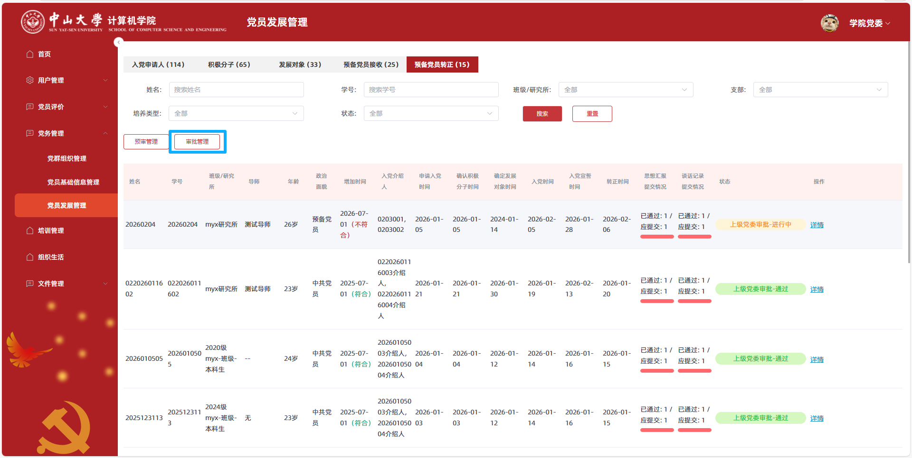

2.  选择状态为"审批中"的审批记录，点击"详情"按钮进入审批完成页面；

3.  填写正式党员的党委审批意见，选择审批时间；

4.  点击"确认审批结果"按钮完成上级党委审批。

### 完成发展流程

#### 党支部管理员（PC端）

检查党员所有资料是否完备，时间节点是否正确后，点击"完成发展流程"按钮完成党员发展全流程。

# 党员发展管理其他操作

## 时间轴管理

### PC端

处于每一个阶段的申请人，均可点击其操作列表的"详情"按钮进入时间轴，可查看各阶段的发展流程。

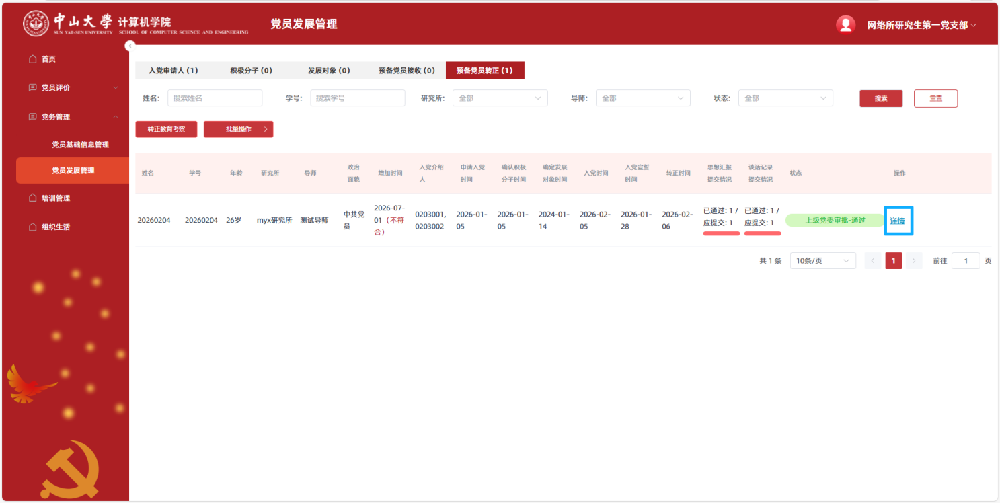

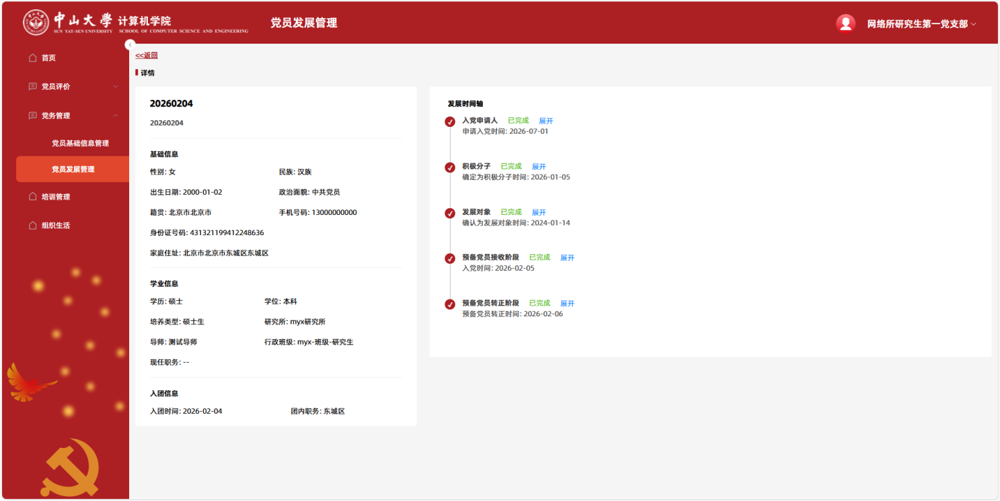

### 小程序端

处于每一个阶段的申请人，均可点击首页"入党管理"按钮进入时间轴，可查看各阶段的发展流程。

 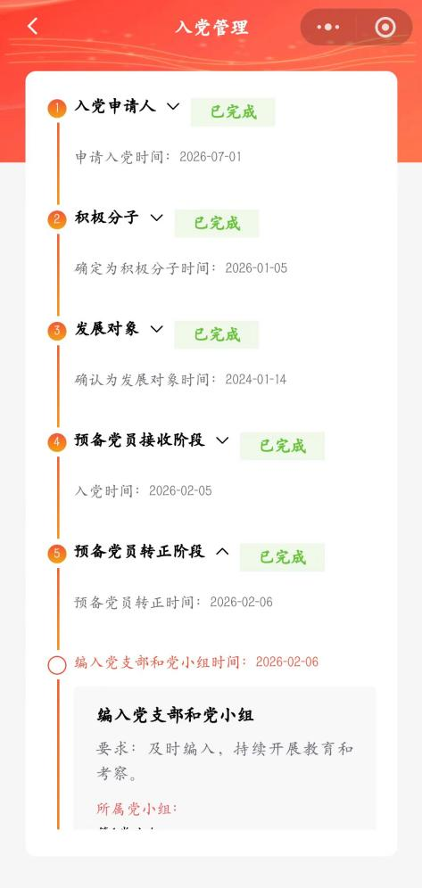

## 消息

### PC端

系统会自动发送相关操作的消息至党支部、党委顶部通知栏，以达到提醒作用。在党员发展管理页面停留1分钟，默认消息已读，不再展示该消息。

### 小程序端

小程序接收到的消息，归入消息列表，点击即可查看。

